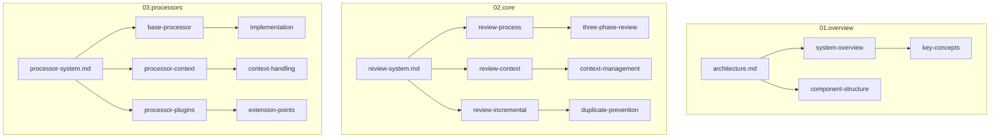

# Code Hedgehog仕様書構成

## 現状の課題

CodeRabbitの調査結果を受けて、以下の観点での仕様書の再構成が必要です：

1. コンテキスト管理の体系化
2. レビュープロセスの詳細化
3. プロセッサー実装の明確化

## 新規構成案



## ディレクトリ構造

```
docs/project-specs/
├── 00.specs-structure.md          # 本文書
│
├── 01.overview/                   # システム概要
│   ├── architecture.md           # アーキテクチャ概要
│   ├── system-concepts.md        # 主要概念の定義
│   └── component-structure.md    # コンポーネント構成
│
├── 02.core/                      # コア機能仕様
│   ├── review-system/
│   │   ├── overview.md          # レビューシステム概要
│   │   ├── process.md           # 3段階レビュープロセス
│   │   ├── context.md          # コンテキスト管理
│   │   └── incremental.md      # インクリメンタルレビュー
│   │
│   └── config/
│       ├── overview.md          # 設定システム概要
│       └── path-based.md        # パスベース設定
│
└── 03.processors/               # プロセッサー仕様
    ├── system/
    │   ├── overview.md         # プロセッサーシステム概要
    │   ├── base.md            # 基本プロセッサー
    │   └── context.md         # コンテキスト管理
    │
    ├── implementation/
    │   ├── guide.md           # 実装ガイド
    │   ├── plugins.md         # プラグイン開発
    │   └── testing.md         # テスト方法
    │
    └── examples/              # 実装例
        ├── minimal.md         # 最小実装
        └── advanced.md        # 高度な実装
```

## 移行計画

### 1. コア機能の再構成
- review-process.mdの内容を02.core/review-system/以下に分割
- コンテキスト管理機能を集約
- インクリメンタルレビューの仕様を追加

### 2. プロセッサー仕様の整理
- base-processor.mdとbase-processor-context.mdを統合
- 実装ガイドを詳細化
- サンプル実装の追加

### 3. ドキュメント間の参照整理
- 相互参照の明確化
- 用語の統一
- 図表の整備

## 更新方針

1. **段階的な移行**
   - 既存文書は当面維持
   - 新規文書の作成を優先
   - 徐々に古い文書を廃止

2. **整合性の維持**
   - 移行中の相互参照の管理
   - バージョン管理の活用
   - レビューの実施

3. **優先順位**
   - コアシステムの文書を優先
   - プロセッサー関連を次に実施
   - 例示文書を最後に整備