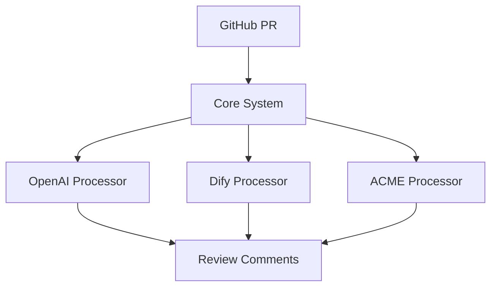
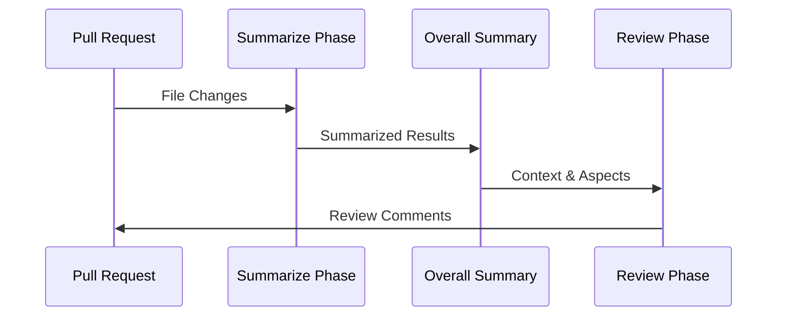

# Code Hedgehog アーキテクチャ仕様書

## システム概要

Code Hedgehogは、プラガブルなAIコードレビュー自動化システムです。多様なAIプロバイダーを統合可能な拡張性の高いアーキテクチャを採用し、GitHubのプルリクエストを解析してインテリジェントなレビューコメントを生成します。

### 主要な特長

1. **プラガブルアーキテクチャ**
   - 環境に応じた最適なプロセッサーの選択
   - プロバイダー固有の最適化が可能
   - 新しいAIサービスの迅速な統合

2. **プロセッサーの多様性**
   - OpenAI、Anthropic等の主要AIサービス向けプロセッサー
   - Difyを活用した柔軟なカスタムプロセッサー
      - 外部ナレッジベースとの統合
      - 動的なレビュールールの注入
   - プロジェクト要件に応じた選択が可能

## アーキテクチャの特徴

### 1. プラグイン可能なプロセッサーアーキテクチャ



- 基本プロセッサーインターフェース（`IPullRequestProcessor`）を実装することで、新しいAIプロバイダーを容易に追加可能
- 各プロセッサーは独自の設定と最適化を持つことが可能

### 2. 3段階レビュープロセス



1. **Summarize Phase**
   - 変更の初期分析
   - トークン数の検証
   - シンプルな変更の判別
   - レビュー必要性の判断

2. **Overall Summary Generation**
   - プルリクエスト全体のコンテキスト把握
   - 変更のアスペクト（側面）の特定
   - ファイル間の関連性の分析

3. **Review Phase**
   - 詳細なコードレビュー
   - コンテキストを考慮したコメント生成
   - PR情報の更新提案

### 3. パスベース設定システム

```typescript
interface PathInstruction {
  path: string;      // Glob pattern
  instructions: string;
}
```

- ファイルパスパターンに基づく柔軟な設定
- 特定のファイル種別に対する固有の指示
- プロジェクト固有のレビュールールの実装

### 4. トークン管理と最適化

- ファイル単位でのトークン数推定
- トークン制限に基づく処理の最適化
- シンプルな変更（フォーマット、コメントのみ等）の効率的なスキップ

### 5. アスペクトベース分析

- 変更の性質に基づく分類
- ファイル間の関連性の追跡
- コンテキストを考慮したレビューコメントの生成

## 拡張性

システムは以下の点で拡張可能に設計されています：

1. **新規プロセッサーの追加**
   - `BaseProcessor`を継承
   - 必要なメソッドをオーバーライド
   - プロセッサー固有の最適化を実装

2. **カスタム設定の追加**
   - `ReviewConfig`の拡張
   - パスベース指示の追加
   - プロジェクト固有のルール実装

3. **VCSプロバイダーの追加**
   - 現在はGitHubをサポート
   - 他のGitホスティングサービスへの拡張が可能

## セキュリティ考慮事項

1. **トークン管理**
   - トークン制限による過剰な処理の防止
   - センシティブな情報の制御

2. **変更の検証**
   - シンプルな変更の識別
   - 不適切な変更の検出

3. **設定の検証**
   - パスパターンの検証
   - 指示内容の検証

## 開発ロードマップ

Code Hedgehogは、プラガブルなアーキテクチャを活かして段階的に機能を拡張していきます：

### Phase 1: プロセッサー拡張（進行中）
- 各種AIサービスとの統合
  - OpenAI GPT-4 プロセッサー
  - Anthropic Claude プロセッサー
  - DifyベースのカスタムAIプロセッサー
    - 外部ナレッジベースの統合
    - プロジェクト固有のレビュールール
    - 柔軟なプロンプト管理
    - レビュールールの動的更新
  - その他のAIプロバイダー対応

各プロセッサーは環境やプロジェクトの要件に応じて選択可能です。特にDifyプロセッサーは、外部ナレッジベースとの統合や動的なレビュールールの注入が可能な、最も柔軟な拡張性を持つプロセッサーとして位置づけられています。

### Phase 2: インタラクション機能（計画中）
- チャットベースのレビュー対話
  - レビューコメントへの質問応答
  - コード変更の提案と議論
  - 複数レビュアー間の対話
- 行単位のコード変更提案
  - GitHub UI からの直接コミット
  - 変更提案の自動生成
  - 複数の選択肢の提示

### Phase 3: VCSプロバイダー拡張（計画中）
- GitLab サポート
  - マージリクエスト対応
  - GitLab CI/CD との統合
- Bitbucket サポート
  - プルリクエスト対応
  - Bitbucket Pipelines との統合

### Phase 4: 分析機能強化（計画中）
- セキュリティ分析
  - 脆弱性スキャン
  - ベストプラクティス検証
- パフォーマンス分析
  - コードパフォーマンスの予測
  - 最適化提案
- カスタムルール
  - プロジェクト固有の分析ルール
  - チーム固有のレビュー基準

特に Phase 1 のプロセッサー拡張は、Code Hedgehogの特徴である**プラガブルアーキテクチャ**を最大限に活かした機能拡張となります。これにより、様々なAIプロバイダーの特性を活かしたレビューが可能になり、より高品質なコードレビューを実現します。