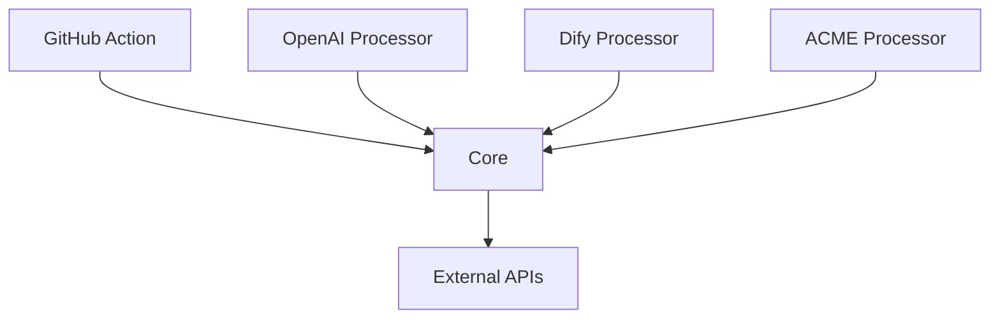

# リポジトリ構造

## 概要

Code Hedgehogは、モノレポ構造を採用し、複数のパッケージを管理しています。各パッケージは独立して開発・テスト可能であり、明確な責務を持っています。

## ディレクトリ構造

```
code-hedgehog/
├── packages/
│   ├── core/               # コアライブラリ
│   │   ├── src/
│   │   │   ├── files/     # ファイル操作
│   │   │   ├── types/     # 型定義
│   │   │   ├── utils/     # ユーティリティ
│   │   │   └── vcs/       # VCS統合
│   │   ├── mod.ts         # パブリックAPI
│   │   └── deps.ts        # 依存関係
│   │
│   ├── processors/        # AIプロセッサー実装
│   │   ├── base/         # 基本プロセッサー
│   │   ├── openai/       # OpenAI実装
│   │   ├── dify/         # Dify実装
│   │   └── acme/         # その他実装
│   │
│   └── action/           # GitHub Actions統合
│       ├── src/
│       └── scripts/
│
└── docs/
    ├── libraries/        # 外部ライブラリのドキュメント
    ├── mcp/             # MCPサーバー関連
    └── project-specs/   # プロジェクト仕様書
```

## パッケージの説明

### core

コアライブラリパッケージ。プロジェクトの中心的な機能を提供します。

- **files/**: ファイル操作関連の機能
  - ファイル変更の検出
  - パッチ処理
  - ファイルシステム操作

- **types/**: 共通の型定義
  - プロセッサーインターフェース
  - ファイル変更の型
  - レビューコメントの型

- **utils/**: ユーティリティ機能
  - パス操作
  - トークン管理
  - その他共通機能

- **vcs/**: バージョン管理システム統合
  - GitHub API連携
  - プルリクエスト操作
  - コメント管理

### processors

各種AIプロセッサーの実装を提供します。

- **base/**: 基本プロセッサー
  - 共通インターフェース
  - 基本実装
  - ユーティリティ

- **openai/**: OpenAI GPT実装
  - GPTモデルとの連携
  - プロンプト管理
  - レスポンス処理

- **dify/**: Difyプロセッサー
  - 外部ナレッジベース統合
  - カスタムワークフロー
  - 動的ルール管理

### action

GitHub Actions用のインテグレーションを提供します。

- **src/**: アクションのソースコード
  - アクション設定
  - ワークフロー処理
  - 環境管理

- **scripts/**: ビルドスクリプト
  - アクションのビルド
  - 依存関係の管理

## 主要なファイル

### モジュールエントリーポイント

各パッケージの `mod.ts` ファイルは、そのパッケージのパブリックAPIを定義します：

```typescript
// packages/core/mod.ts
export * from './src/types/mod.ts';
export * from './src/utils/path.ts';
export * from './src/files/mod.ts';
export * from './src/vcs/mod.ts';
```

### 依存関係管理

各パッケージの `deps.ts` ファイルで、外部依存を一元管理します：

```typescript
// packages/core/deps.ts
export * from 'npm:neverthrow';
export * from '@octokit/rest';
// その他の依存
```

## 依存関係の流れ



## 開発ガイドライン

1. **モジュール間の依存**
   - 循環参照を避ける
   - core パッケージへの一方向の依存のみ許可
   - processors 間の相互依存は禁止

2. **パブリックAPI**
   - mod.ts で明示的にエクスポート
   - 内部実装の隠蔽
   - 型定義の提供

3. **バージョン管理**
   - パッケージごとの独立したバージョニング
   - 互換性の維持
   - 変更履歴の管理