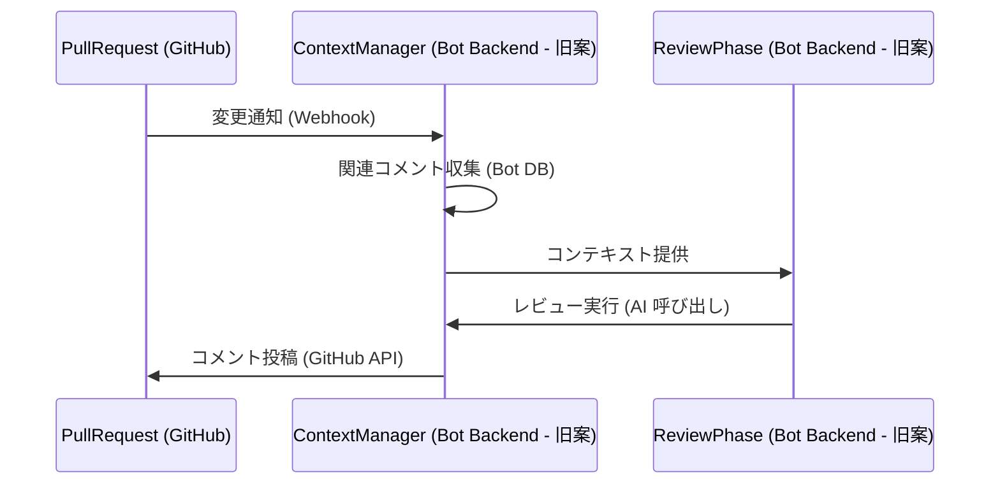

# レビューコンテキスト管理仕様 (旧設計案)

**重要:** このドキュメントは、Code Hedgehog の初期設計段階で検討されたレビューコンテキスト管理に関する**古い仕様案**です。現在の設計では、GitHub Actions をベースとし、コンテキスト管理の多くを GitHub の標準機能 (コメントスレッド、Resolve conversation、Checks API) に依存しています。

現在のコンテキスト収集・管理に関する仕様は、以下のドキュメントを参照してください。
-   [GitHub Bot 仕様](../../project-specs/05.github-bot/overview.md) (特にセクション 2.2 コンテキスト収集)
-   [GitHub Bot: コメント関連機能仕様](../../project-specs/05.github-bot/comment-chain-features.md)

---

## 1. 概要 (旧設計案)

(旧設計案) Code Hedgehog のレビューコンテキスト管理システムは、レビューの質と一貫性を向上させるため、Bot 自身が以下の情報を収集・管理・永続化することを想定していました。

-   コメントの階層構造 (コメントチェーン)
-   レビュー履歴と指摘の解決状態
-   これらの情報に基づくレビュープロセスの最適化

**現在の設計との違い:** 現在の設計では、コメントの階層構造は GitHub のスレッド機能、解決状態は Resolve conversation 機能に依存します。Bot はこれらの情報を GitHub API 経由で取得・利用しますが、独自に永続化・管理する責務は最小限に抑えられます。

## 2. コンテキスト管理の構造 (旧設計案)

(旧設計案) 当初想定されていたコンテキスト要素は以下の通りです。

```mermaid
graph TD
    A[レビューコンテキスト (旧案)] --> B[静的コンテキスト]
    A --> C[動的コンテキスト (Bot管理)]
    
    B --> D[プルリクエスト情報 (GitHub API)]
    B --> E[変更セット (GitHub API)]
    B --> F[設定情報 (.coderabbitai.yaml)]
    
    C --> G[レビューコメント (Bot DB)]
    C --> H[レビュー履歴 (Bot DB)]
    C --> I[インタラクション履歴 (Bot DB)]
    
    subgraph Bot 内部管理 (旧案)
        G --> J[コメントチェーン管理]
        G --> K[解決状態管理]
        H --> L[過去の指摘DB]
        H --> M[修正履歴DB]
    end
```

**現在の設計との違い:** 現在の設計では、「動的コンテキスト (Bot管理)」の部分は大幅に縮小され、主に GitHub API から取得した情報 (`CommentInfo[]` など) を `Action Runner` が一時的に保持し、プロセッサに渡す形になります。独自のデータベース (Bot DB) による永続化は原則として行いません。

## 3. コメント管理システム (旧設計案)

### 3.1 コメントの構造 (旧設計案)

(旧設計案) Bot が内部で管理するコメント情報の構造案です。

```typescript
// 旧設計案のコメント構造
interface ReviewComment {
  id: string; // Bot 内部 ID? GitHub Comment ID?
  parentId?: string;     // Bot 内部での親子関係管理
  path: string;          // 対象ファイル
  position: {
    startLine: number;
    endLine: number;
  };
  context: { // レビューの側面やフェーズ (旧設計の概念)
    aspect: string;
    phase: string;
  };
  state: 'open' | 'resolved' | 'outdated'; // Bot 内部での状態管理
}
```

**現在の設計との違い:** 現在の設計では、GitHub API から取得するコメント情報 (`CommentInfo` 型など) をベースにします。これには GitHub 上の ID (`id`, `node_id`), 返信先 ID (`in_reply_to_id`), ファイルパス (`path`), 行番号 (`line`, `start_line`), 本文 (`body`), 投稿者 (`user`), 投稿日時 (`created_at`) などが含まれます。親子関係は `in_reply_to_id` で表現され、解決状態は別途スレッド情報を取得して確認します。Bot 独自の `aspect`, `phase`, `state` 管理は行いません。

### 3.2 コメントチェーンの管理 (旧設計案)

(旧設計案) Bot 内部の `ContextManager` がコメントチェーンを管理する想定でした。



**現在の設計との違い:** 現在の設計では、`Action Runner` が GitHub API からコメント履歴を収集し、プロセッサに渡します。コメントチェーンの管理は GitHub のスレッド機能に依存します。

## 4. レビュー履歴の活用 (旧設計案)

### 4.1 履歴の追跡 (旧設計案)

(旧設計案) Bot が内部 DB でレビュー履歴を詳細に追跡することを想定していました。

-   パスベースの履歴管理
-   アスペクトごとの指摘パターン (旧設計の概念)
-   解決状態の追跡 (Bot 内部管理)

**現在の設計との違い:** 現在の設計では、レビュー履歴は GitHub API から取得するコメント情報 (`CommentInfo[]`) そのものです。解決状態は GitHub の Resolve conversation 機能に依存します。Bot はこれらの情報を活用しますが、独自に詳細な履歴 DB を構築・追跡はしません。

### 4.2 最適化への活用 (旧設計案)

(旧設計案) 内部 DB の履歴情報を活用した最適化を想定していました。

1.  **コメントの重複排除:** Bot が過去の指摘 DB を参照して重複をチェック。
2.  **レビュー精度の向上:** Bot が過去の指摘パターンを学習。

**現在の設計との違い:** 現在の設計でも、プロセッサは渡されたコメント履歴 (`commentHistory`) を参照して、重複指摘の回避や文脈理解の向上を図ります。ただし、これは実行時のコンテキスト情報に基づくものであり、Bot が長期的な学習モデルや詳細な履歴 DB を持つわけではありません。

## 5. プロセッサーとの統合 (旧設計案)

(旧設計案) Bot 内部の `ContextManager` がプロセッサに必要なコンテキスト情報を提供するインターフェース (`ContextProvider`) を持つことを想定していました。

### 5.1 コンテキスト提供インターフェース (旧設計案)

```typescript
// 旧設計案のインターフェース
interface ContextProvider {
  // 特定パスのレビュー履歴取得 (Bot DB から)
  getReviewHistory(path: string): Promise<ReviewHistory>;
  
  // コメントチェーンの取得 (Bot DB から)
  getCommentChain(commentId: string): Promise<CommentChain>;
  
  // アスペクトベースのコンテキスト取得 (旧設計の概念)
  getAspectContext(aspect: string): Promise<AspectContext>;
}
```

**現在の設計との違い:** 現在の設計では、このような `ContextProvider` インターフェースは存在しません。`Action Runner` が GitHub API から必要な情報 (PR 情報, ファイル差分, コメント履歴など) を収集し、`ProcessInput` または `InteractionInput` というデータ構造にまとめて、プロセッサ (`IPullRequestProcessor` 実装) のメソッド (`process` または `handleInteraction`) に直接渡します。プロセッサは渡された入力データから必要なコンテキストを利用します。

### 5.2 プロセッサーの拡張ポイント (旧設計案)

(旧設計案) プロセッサが `ContextProvider` を通じて取得したコンテキストを活用し、またレビュー結果をフィードバックして `ContextManager` が学習することを想定していました。

1.  **コンテキスト活用:** プロセッサが `getReviewHistory` などを呼び出して履歴を参照。
2.  **フィードバック収集:** プロセッサがレビュー結果 (コメントの有効性など) を `ContextManager` に返し、DB を更新・学習。

**現在の設計との違い:** 現在の設計では、プロセッサは `Action Runner` から渡された `ProcessInput`/`InteractionInput` 内のコンテキスト情報 (特に `commentHistory`) を活用します。プロセッサから `Action Runner` へのフィードバックはレビュー結果 (`ProcessOutput`/`InteractionOutput`) のみであり、Bot 自身がそれを蓄積・学習する仕組みは持ちません。

## 6. 実装時の考慮事項 (旧設計案)

(旧設計案) Bot が独自にコンテキスト管理・永続化を行う場合に考慮すべき点です。

### 6.1 データ永続化 (旧設計案)

-   コメントチェーンや履歴データを Bot 独自のデータベースで管理する必要性。
-   データの整合性維持や効率的な保存、キャッシュ戦略。

**現在の設計との違い:** データ永続化の必要性は大幅に低減されました。コメントやスレッドの状態は GitHub 上で管理されるため、Bot 側での複雑な永続化は不要です。

### 6.2 パフォーマンス最適化 (旧設計案)

-   Bot DB から必要なコンテキストを選択的に読み込む必要性。
-   インクリメンタルな更新処理 (差分のみを処理)。

**現在の設計との違い:** パフォーマンス最適化は依然として重要ですが、焦点が変わります。GitHub API の効率的な利用 (リクエスト数の削減、バッチ処理)、`Action Runner` での処理時間短縮、プロセッサでのトークン数管理などが主な課題となります。インクリメンタル更新は現時点では実装されていません。

### 6.3 拡張性の確保 (旧設計案)

-   カスタムコンテキストプロバイダーやプラグイン可能な永続化層の検討。

**現在の設計との違い:** 拡張性は、主にプロセッサ (`IPullRequestProcessor`) の実装を追加・選択可能にすることや、GitHub Actions のワークフローをカスタマイズ可能にすることで確保されます。永続化層のプラグイン可能性は、現在の設計では主要な関心事ではありません。