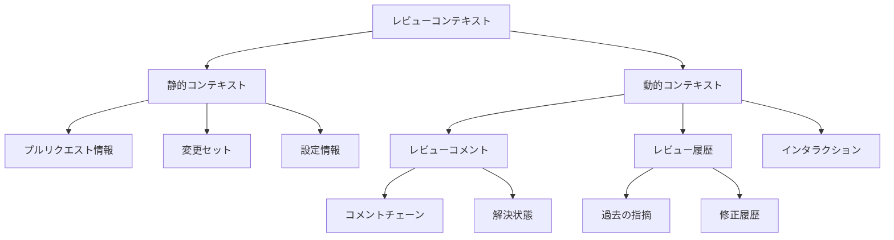
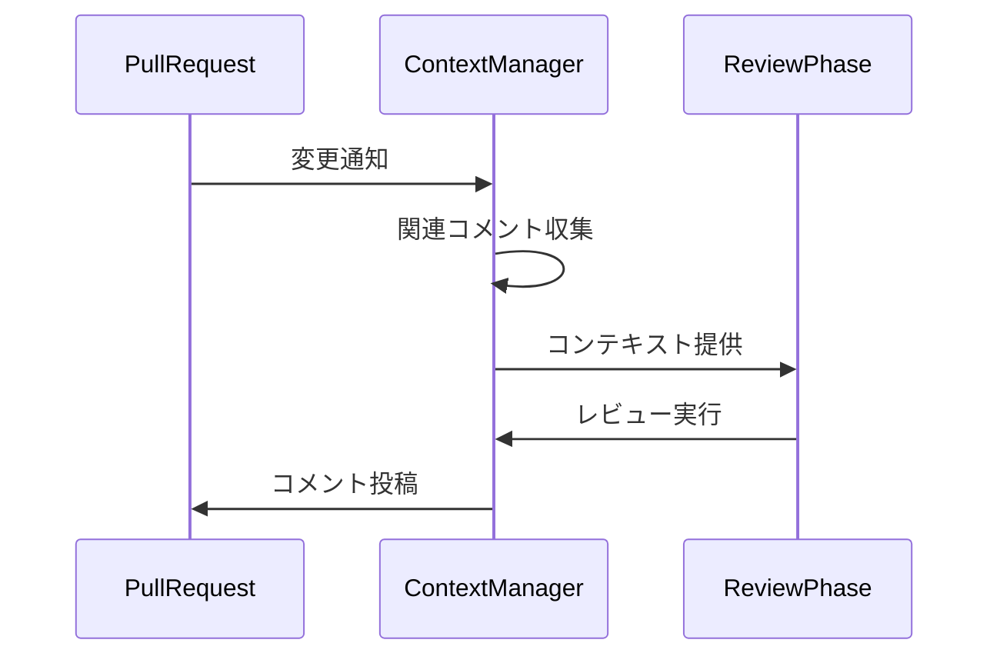

# レビューコンテキスト管理仕様

## 1. 概要

Code Hedgehogのレビューコンテキスト管理システムは、レビューの質と一貫性を向上させるため、以下の機能を提供します：

- コメントの階層構造管理
- レビュー履歴の追跡
- コンテキストベースの最適化

## 2. コンテキスト管理の構造



## 3. コメント管理システム

### 3.1 コメントの構造

```typescript
interface ReviewComment {
  id: string;
  parentId?: string;     // 親コメントへの参照
  path: string;          // 対象ファイル
  position: {
    startLine: number;
    endLine: number;
  };
  context: {
    aspect: string;      // 関連アスペクト
    phase: string;       // レビューフェーズ
  };
  state: 'open' | 'resolved' | 'outdated';
}
```

### 3.2 コメントチェーンの管理



## 4. レビュー履歴の活用

### 4.1 履歴の追跡

- パスベースの履歴管理
- アスペクトごとの指摘パターン
- 解決状態の追跡

### 4.2 最適化への活用

1. **コメントの重複排除**
   - 同一箇所への類似コメントの検出
   - 解決済み指摘の考慮
   - コンテキストに基づく優先度付け

2. **レビュー精度の向上**
   - 過去の指摘パターンの学習
   - ファイル間の関連性の考慮
   - 変更の影響範囲の特定

## 5. プロセッサーとの統合

### 5.1 コンテキスト提供インターフェース

```typescript
interface ContextProvider {
  // 特定パスのレビュー履歴取得
  getReviewHistory(path: string): Promise<ReviewHistory>;
  
  // コメントチェーンの取得
  getCommentChain(commentId: string): Promise<CommentChain>;
  
  // アスペクトベースのコンテキスト取得
  getAspectContext(aspect: string): Promise<AspectContext>;
}
```

### 5.2 プロセッサーの拡張ポイント

1. **コンテキスト活用**
   - レビュー履歴の参照
   - 関連コメントの考慮
   - アスペクトベースの最適化

2. **フィードバック収集**
   - コメントの有効性追跡
   - 解決パターンの学習
   - レビュー精度の改善

## 6. 実装時の考慮事項

### 6.1 データ永続化

- コメントチェーンの整合性維持
- 履歴データの効率的な保存
- キャッシュ戦略の実装

### 6.2 パフォーマンス最適化

- 必要なコンテキストの選択的読み込み
- インクリメンタルな更新処理
- メモリ使用量の制御

### 6.3 拡張性の確保

- カスタムコンテキストプロバイダー
- プラグイン可能な永続化層
- フレキシブルなデータモデル