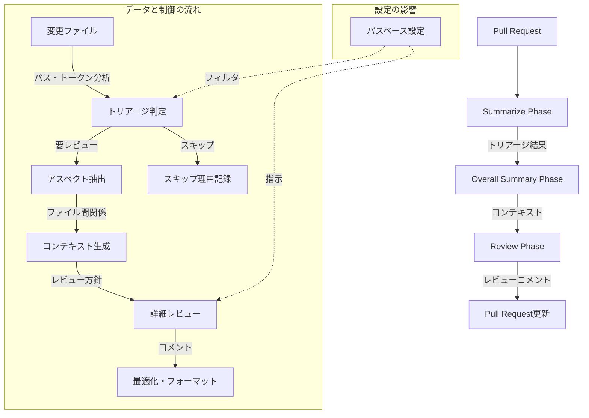

# 3段階レビュープロセス仕様

## 概要

Code Hedgehogのレビュープロセスは、効率的かつ高品質なコードレビューを実現するため、以下の3段階で構成されています：

1. Summarize Phase（初期スクリーニング）
2. Overall Summary Phase（コンテキスト分析）
3. Review Phase（詳細レビュー）

## 1. Summarize Phase（トリアージ）

### 目的
- 個別ファイルの初期トリアージ
- レビュー必要性の判断
- トークン使用量の最適化

### 処理フロー
1. **変更ファイルの分析**
   - パッチ内容の解析
   - 変更の種類の判別（追加/修正/削除）
   - トークン数の計算
   - ファイルタイプとパスパターンの確認

2. **トリアージ判定**
   - シンプルな変更の検出
     - フォーマット変更
     - コメントの追加/修正
     - 空白行の変更
   - トークン制限のチェック
   - レビュー必要性の判定

### 出力
```typescript
interface SummarizeResult {
  needsReview: boolean;
  reason: string;
  aspects: string[];  // 変更の性質を表すタグ
}
```

## 2. Overall Summary Phase

### 目的
- プルリクエスト全体の把握
- 変更間の関連性の分析
- レビュー方針の決定

### 処理フロー
1. **コンテキスト収集**
   - PRタイトルと説明の分析
   - コミットメッセージの分析
   - 変更ファイル間の関係性分析

2. **アスペクト抽出**
   - Summarize Phaseで生成された各ファイルのサマリー文字列を分析
   - 変更の主要なテーマや性質を特定
   - 共通の特徴を持つファイルをグループ化
   - 関連するファイル群をアスペクトとして分類
   - 後続のレビューフェーズで活用するコンテキスト情報を生成

### 出力
```typescript
interface OverallSummary {
  title: string;
  description: string;
  aspectMappings: Array<{
    aspect: string;
    files: string[];
  }>;
}
```

## 3. Review Phase

### 目的
- 詳細なコードレビュー
- 具体的な改善提案
- コードの品質向上

### 処理フロー
1. **詳細レビュー実行**
   - 個別ファイルのレビュー
   - コンテキストを考慮したコメント生成
   - 改善提案の作成

2. **レビュー結果の最適化**
   - コメントの重複排除
   - 優先順位付け
   - フォーマットの統一

### 出力
```typescript
interface ReviewResult {
  comments: Array<{
    path: string;
    line: number;
    body: string;
    suggestions?: string[];
  }>;
  summary?: string;
}
```

## フェーズ間のデータフロー



## トークン使用量の最適化

各フェーズでは、以下の方針でトークン使用量を最適化します：

1. **Summarize Phase**
   - ファイル単位でのトークン制限
   - シンプルな変更の早期スキップ

2. **Overall Summary Phase**
   - バッチ処理による効率化
   - 要約情報の再利用

3. **Review Phase**
   - 必要なファイルのみレビュー
   - コンテキストの効率的な利用

## エラー処理

各フェーズで以下のエラー状況を適切に処理します：

1. **トークン制限超過**
   - 分割処理の実施
   - 要約モードへの切り替え

2. **処理タイムアウト**
   - 部分的な結果の保存
   - 再試行メカニズム

3. **API制限**
   - バックオフ戦略の実装
   - キャッシュの活用

## 拡張性

各フェーズは以下の点で拡張可能です：

1. **カスタム分析ロジック**
   - プロジェクト固有のルール
   - 言語固有の最適化

2. **新規アスペクトの追加**
   - セキュリティチェック
   - パフォーマンス分析

3. **レビュー戦略のカスタマイズ**
   - チーム固有のルール
   - CI/CD統合