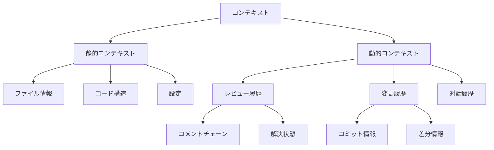
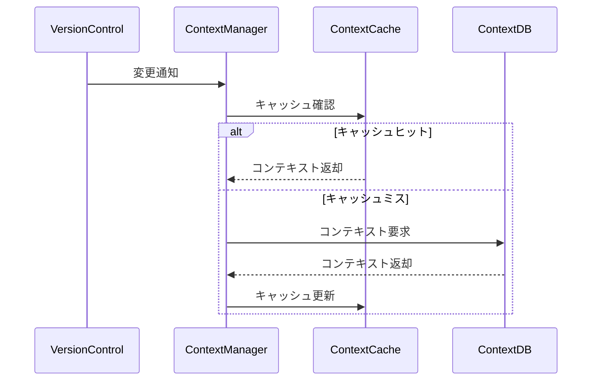
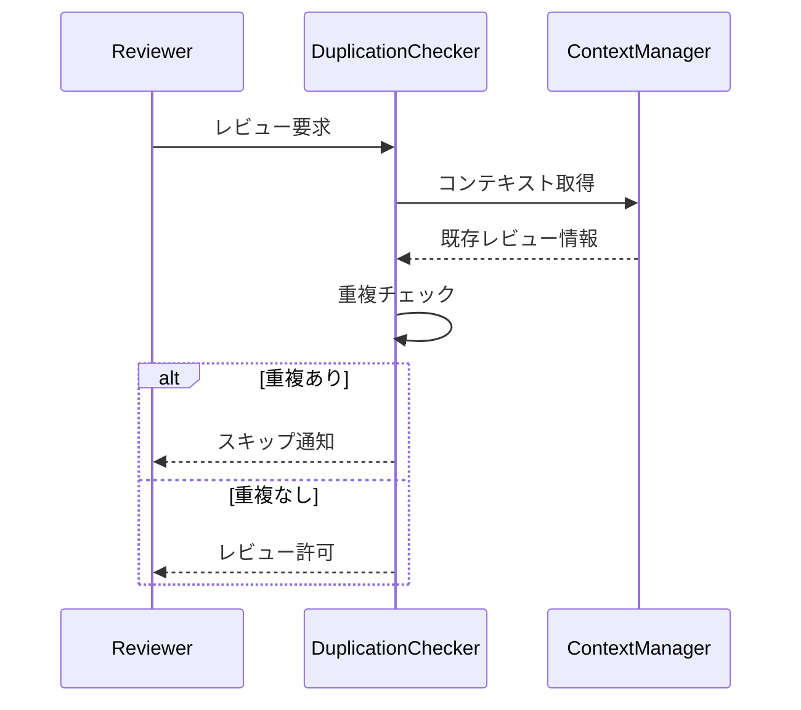

# レビューシステムのコンテキスト管理

## 1. コンテキスト管理の目的

Code Hedgehogのコンテキスト管理システムは、以下の目標を達成します：

1. **レビューの質の向上**
   - 文脈を考慮した判断の実現
   - 一貫性のある指摘の提供
   - 重複の効果的な防止

2. **履歴の活用**
   - 過去のレビュー内容の参照
   - 変更の追跡と理解
   - パターンの認識と学習

3. **効率的な処理**
   - 必要な情報の選択的利用
   - リソースの最適活用
   - 処理の高速化

## 2. コンテキストの階層構造



## 3. コンテキストの種類と役割

### 3.1 静的コンテキスト

1. **ファイル情報**
   - パス情報
   - 言語種別
   - ファイルタイプ

2. **コード構造**
   - AST情報
   - シンボル定義
   - 依存関係

3. **設定情報**
   - パスベース設定
   - レビュールール
   - 除外パターン

### 3.2 動的コンテキスト

1. **レビュー履歴**
   - 過去の指摘内容
   - 解決状態
   - フィードバック

2. **変更履歴**
   - コミット情報
   - 差分データ
   - 変更パターン

3. **対話履歴**
   - コメントチェーン
   - 議論の流れ
   - 決定事項

## 4. コンテキストの管理方式

### 4.1 コンテキストの収集



### 4.2 コンテキストの更新

1. **インクリメンタルな更新**
   - 変更箇所の特定
   - 差分の計算
   - 部分的な更新

2. **整合性の維持**
   - 依存関係の追跡
   - 参照の更新
   - 一貫性チェック

### 4.3 コンテキストの利用

1. **コンテキストの選択**
   - 必要な情報の特定
   - 範囲の決定
   - 優先度付け

2. **コンテキストの組み合わせ**
   - 複数ソースの統合
   - 関連付け
   - フィルタリング

## 5. 重複防止メカニズム

### 5.1 重複の検出

1. **位置ベースの重複**
   - 行範囲の重なり
   - コードブロックの一致
   - 移動コードの追跡

2. **内容ベースの重複**
   - コメント内容の類似性
   - 指摘カテゴリの一致
   - 解決状態の考慮

### 5.2 重複の防止



## 6. 実装時の考慮事項

### 6.1 性能最適化

1. **キャッシュ戦略**
   - メモリ使用の管理
   - 更新頻度の制御
   - 有効期限の設定

2. **非同期処理**
   - バックグラウンド更新
   - 並行処理
   - イベント駆動

### 6.2 拡張性

1. **プラグイン機構**
   - カスタムコンテキスト
   - 独自の重複チェック
   - 外部システム連携

2. **設定のカスタマイズ**
   - コンテキスト選択ルール
   - 重複判定基準
   - 更新戦略

## 7. インターフェース

### 7.1 コンテキストプロバイダー

```typescript
interface ContextProvider {
  // コンテキストの取得
  getContext(path: string): Promise<Context>;
  
  // レビュー履歴の取得
  getReviewHistory(path: string): Promise<ReviewHistory>;
  
  // コメントチェーンの操作
  getCommentChain(id: string): Promise<CommentChain>;
  updateCommentChain(chain: CommentChain): Promise<void>;
}
```

### 7.2 重複チェッカー

```typescript
interface DuplicationChecker {
  // 重複チェック
  checkDuplication(review: Review): Promise<boolean>;
  
  // 重複情報の取得
  getDuplicateInfo(review: Review): Promise<DuplicateInfo>;
}
```

## 8. エラー処理

1. **コンテキスト取得エラー**
   - フォールバック戦略
   - 部分的な処理継続
   - エラーレポート

2. **整合性エラー**
   - 自動修復
   - 手動修復支援
   - ログ記録