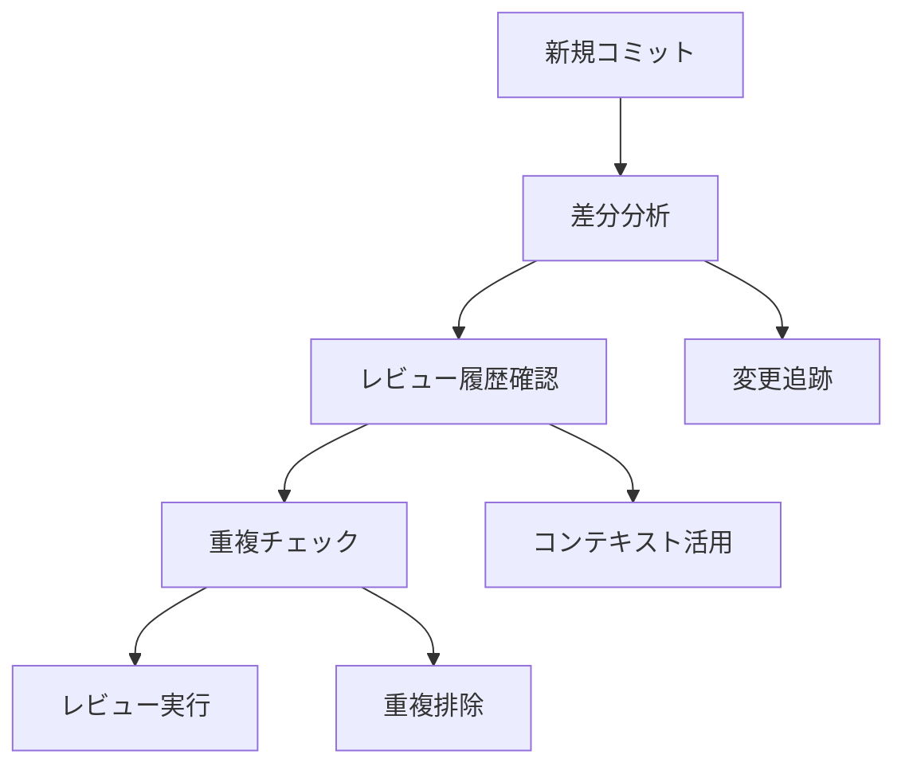
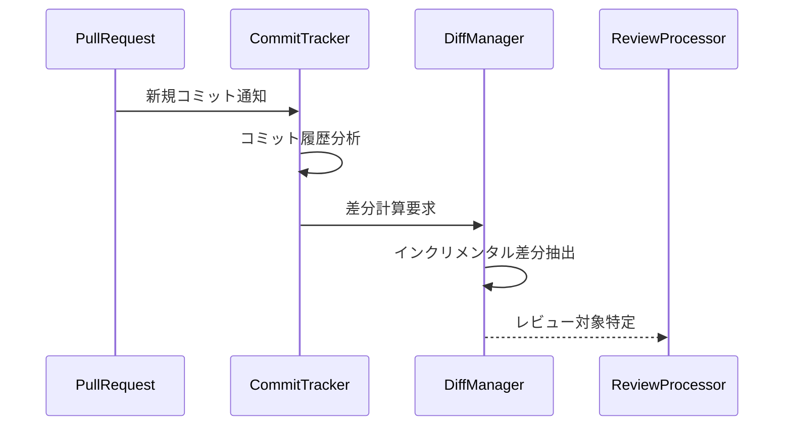
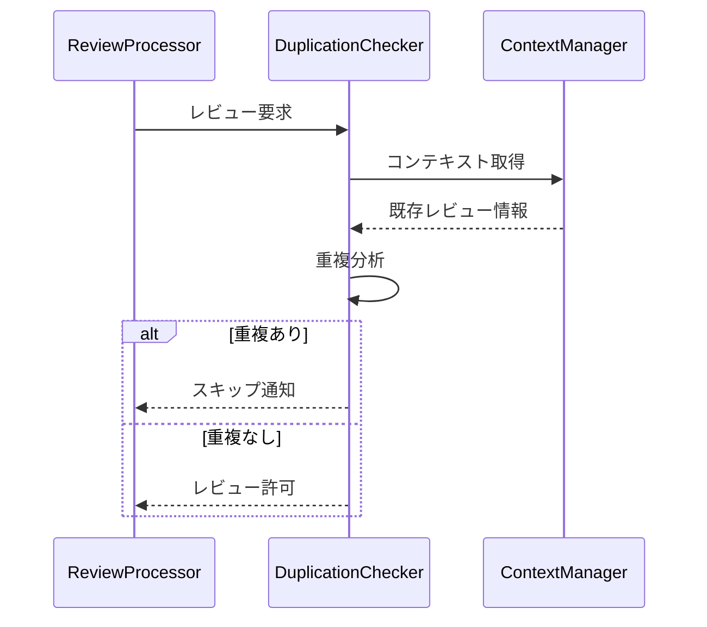

# インクリメンタルレビューと重複防止

## 1. インクリメンタルレビューの概要

Code Hedgehogのインクリメンタルレビューは、変更の追加性と履歴を考慮した効率的なレビュー処理を実現します。



## 2. 変更の追跡と分析

### 2.1 コミットベースの追跡



1. **コミット履歴管理**
   - 最後のレビュー済みコミットの記録
   - 新規コミットの検出
   - 変更の連続性の追跡

2. **差分計算**
   - インクリメンタルな差分抽出
   - 変更の分類
   - 影響範囲の特定

### 2.2 変更の分類

```typescript
interface ChangeClassification {
  type: 'addition' | 'modification' | 'deletion';
  scope: 'method' | 'class' | 'file';
  context: {
    previousReviews: ReviewReference[];
    relatedChanges: ChangeReference[];
  };
}
```

## 3. 重複防止メカニズム

### 3.1 重複検出

1. **位置ベースの検出**
   ```typescript
   interface LocationBasedCheck {
     filePath: string;
     lineRange: {
       start: number;
       end: number;
     };
     changeContext: {
       previousVersion: string;
       currentVersion: string;
     };
   }
   ```

2. **内容ベースの検出**
   ```typescript
   interface ContentBasedCheck {
     category: string;
     severity: string;
     pattern: string;
     context: {
       similarComments: CommentReference[];
       resolutions: ResolutionReference[];
     };
   }
   ```

### 3.2 重複の予防



## 4. インクリメンタル処理の最適化

### 4.1 処理の並行化

1. **非同期処理**
   - コミット監視
   - 差分計算
   - コンテキスト取得

2. **キャッシュ戦略**
   - 差分情報のキャッシュ
   - コンテキストのキャッシュ
   - レビュー結果のキャッシュ

### 4.2 リソース管理

```typescript
interface ResourceManagement {
  // メモリ使用の制御
  memoryLimits: {
    diffCache: number;
    contextCache: number;
    resultCache: number;
  };
  
  // 処理の制限
  processingLimits: {
    maxConcurrentReviews: number;
    maxDiffSize: number;
    timeoutMs: number;
  };
}
```

## 5. コンテキストの活用

### 5.1 履歴の利用

1. **レビュー履歴**
   - 過去の指摘内容
   - 解決状態
   - パターンの学習

2. **変更履歴**
   - コードの進化
   - 影響の追跡
   - 関連性の分析

### 5.2 コンテキストの伝播

```typescript
interface ContextPropagation {
  // コミット間の関係
  commitRelations: {
    parent: string;
    children: string[];
    reviewState: ReviewState;
  };
  
  // 変更の連鎖
  changeChain: {
    origin: ChangeReference;
    related: ChangeReference[];
    impact: ImpactAnalysis;
  };
}
```

## 6. インターフェース定義

### 6.1 インクリメンタルレビューマネージャー

```typescript
interface IncrementalReviewManager {
  // 変更の追跡
  trackChanges(commits: Commit[]): Promise<ChangeTracking>;
  
  // 重複チェック
  checkDuplication(review: Review): Promise<DuplicationResult>;
  
  // コンテキスト管理
  manageContext(change: Change): Promise<ContextUpdate>;
  
  // レビュー実行
  executeReview(
    change: Change,
    context: ReviewContext
  ): Promise<ReviewResult>;
}
```

### 6.2 重複チェッカー

```typescript
interface DuplicationChecker {
  // 位置ベースチェック
  checkLocation(
    location: Location,
    context: ReviewContext
  ): Promise<boolean>;
  
  // 内容ベースチェック
  checkContent(
    content: Content,
    context: ReviewContext
  ): Promise<boolean>;
  
  // 重複情報の取得
  getDuplicateInfo(
    review: Review
  ): Promise<DuplicateInfo>;
}
```

## 7. エラー処理

### 7.1 リカバリー手順

1. **差分計算エラー**
   - 部分的な再計算
   - フォールバック方式
   - エラーログ

2. **重複チェックエラー**
   - デフォルト判定
   - 手動確認フラグ
   - エラー通知

### 7.2 整合性の維持

1. **状態の一貫性**
   - トランザクション管理
   - 競合解決
   - バックアップ

2. **データの整合性**
   - 検証チェック
   - 修復手順
   - 監査ログ

## 8. 拡張性

### 8.1 カスタマイズポイント

1. **重複検出ロジック**
   - カスタムルール
   - パターンマッチング
   - 閾値設定

2. **コンテキスト処理**
   - 外部ソース連携
   - カスタムフィルター
   - 優先度制御