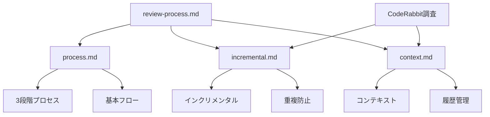

# レビューシステム仕様書移行計画

## 1. 現状分析

### 1.1 既存ドキュメント

現在のreview-process.mdは以下の内容を含んでいます：

1. **基本構造**
   - 3段階レビュープロセス
   - フェーズ間のデータフロー
   - 各フェーズの目的と出力

2. **実装詳細**
   - トークン最適化
   - エラー処理
   - 拡張性

### 1.2 新規知見（CodeRabbitリサーチ）

CodeRabbitの調査から得られた重要な知見：

1. **コンテキスト管理**
   - 階層的な構造
   - 履歴管理
   - コメントチェーン

2. **重複防止**
   - インクリメンタル処理
   - コミット追跡
   - 重複検出

## 2. 新構成への移行

### 2.1 ドキュメント構成

### 2.2 内容の再配置

1. **process.md**
   - 3段階プロセスの基本構造
   - 各フェーズの目的と役割
   - フェーズ間のデータフロー
   - 基本的なエラー処理

2. **incremental.md**
   - インクリメンタルレビューの仕組み
   - 重複防止メカニズム
   - コミット追跡
   - 差分分析

3. **context.md（既存）**
   - コンテキスト管理
   - 履歴追跡
   - コメントチェーン

## 3. 移行手順

### 3.1 フェーズ1：基本構造の移行

1. **process.mdの作成**
   - 3段階プロセスの定義
   - フェーズ間フローの整理
   - 基本インターフェースの定義

2. **既存機能の移行**
   - トリアージロジック
   - サマリー生成
   - レビュー実行

### 3.2 フェーズ2：拡張機能の追加

1. **incremental.mdの作成**
   - インクリメンタル処理の設計
   - 重複防止の実装
   - 差分管理の仕組み

2. **コンテキスト連携**
   - 履歴管理との統合
   - コメントチェーンの活用
   - 情報の再利用

### 3.3 フェーズ3：最適化と統合

1. **パフォーマンス最適化**
   - トークン使用の効率化
   - キャッシュ戦略
   - 並行処理

2. **エラー処理の体系化**
   - 統一的なエラー管理
   - リカバリー手順
   - 監視と報告

## 4. 品質確保

### 4.1 レビュー基準

1. **整合性**
   - 概念の一貫性
   - インターフェースの統一
   - 用語の標準化

2. **完全性**
   - 機能の網羅
   - エッジケースの考慮
   - 拡張ポイントの明確化

### 4.2 検証項目

1. **機能面**
   - プロセスの実行可能性
   - インターフェースの適切性
   - エラー処理の妥当性

2. **非機能面**
   - パフォーマンス要件
   - スケーラビリティ
   - 保守性

## 5. タイムライン

1. **Week 1**
   - process.mdの作成
   - 基本機能の移行
   - レビューと調整

2. **Week 2**
   - incremental.mdの作成
   - 拡張機能の実装
   - 統合テスト

3. **Week 3**
   - 最終調整
   - ドキュメント完成
   - 移行完了確認