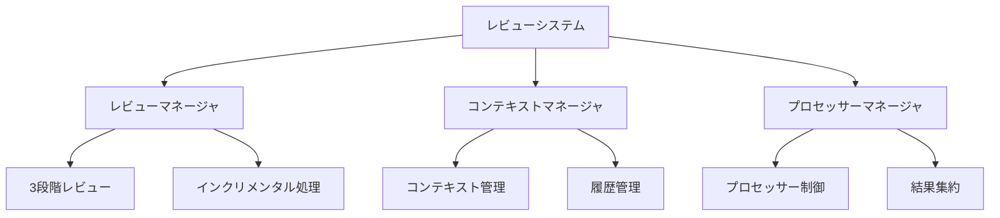
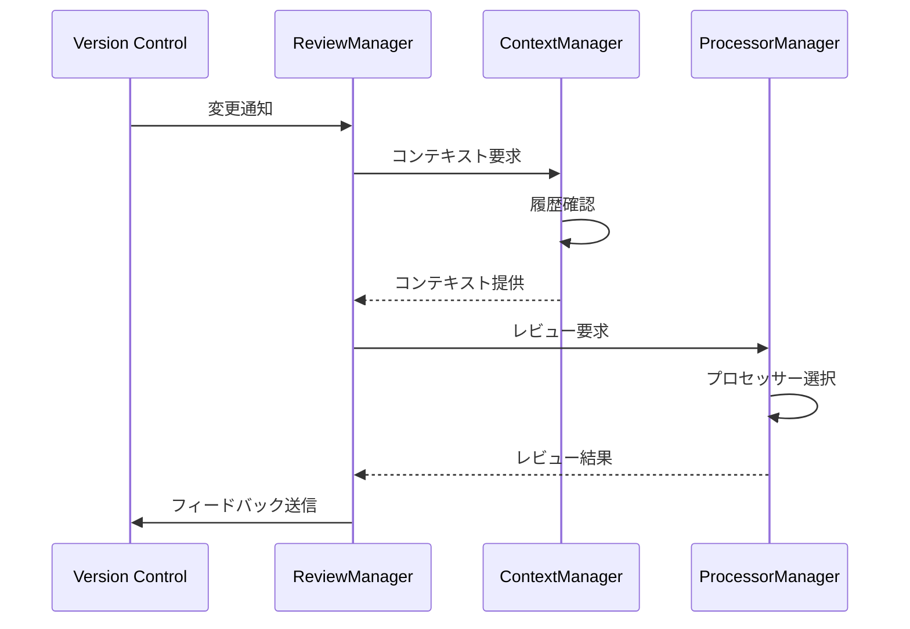

# レビューシステム概要

## 1. システムの目的

Code Hedgehogのレビューシステムは、以下の目標を達成するために設計されています：

1. **効率的なレビュー**
   - [詳細はprocess.mdを参照](./process.md)
   - 3段階のレビュープロセスによる段階的な分析
   - インクリメンタルな変更追跡による重複の防止
   - 効率的なリソース配分

2. **コンテキストの理解**
   - [詳細はcontext.mdを参照](./context.md)
   - 変更の文脈を階層的に把握
   - レビュー履歴の効果的な活用
   - 関連性の分析と活用

3. **一貫性の維持**
   - 統一的なレビュー基準の適用
   - プロセッサーの標準化による品質確保
   - フィードバックの追跡と活用

## 2. システム構成

## 3. 主要コンポーネント

### 3.1 レビューマネージャ

- レビュープロセスの制御
- フェーズ間の調整
- 結果の集約

### 3.2 コンテキストマネージャ

- コードコンテキストの管理
- レビュー履歴の追跡
- 関連情報の提供

### 3.3 プロセッサーマネージャ

- プロセッサーの初期化
- タスクの割り当て
- 結果の収集

## 4. 処理フロー

## 5. 連携システム

### 5.1 バージョン管理システム

- コミット情報の取得
- 差分の解析
- フィードバックの投稿

### 5.2 プロセッサー

- レビュー処理の実行
- コンテキストの利用
- 結果の生成

### 5.3 設定管理

- パスベース設定の解釈
- プロセッサー設定の管理
- レビュールールの制御

## 6. 拡張ポイント

### 6.1 プロセッサーの拡張

- カスタムプロセッサーの追加
- 独自ルールの実装
- 特殊なコンテキスト処理

### 6.2 コンテキスト処理の拡張

- 新しいコンテキストタイプの追加
- カスタム履歴管理
- 外部情報との連携

## 7. 運用上の考慮事項

### 7.1 パフォーマンス

- 並行処理の活用
- キャッシュの利用
- リソース使用の最適化

### 7.2 スケーラビリティ

- 分散処理への対応
- 大規模リポジトリの処理
- 複数プロセッサーの協調

### 7.3 信頼性

- エラー処理
- 状態の一貫性維持
- バックアップと復旧

## 8. 関連ドキュメント

以下のドキュメントで、各コンポーネントの詳細な仕様を説明しています：

- [3段階レビュープロセス](./process.md) - レビューフローの詳細な仕様と実装
- [コンテキスト管理](./context.md) - 効率的なレビューを支えるコンテキスト管理システムの仕様
