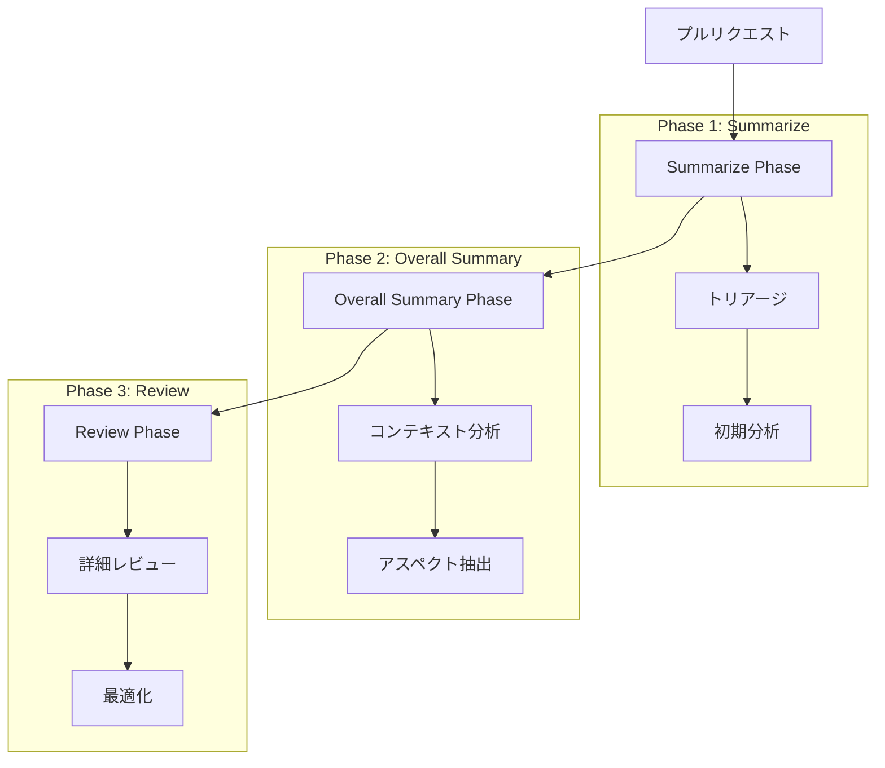

# 3段階レビュープロセス詳細仕様

## 1. プロセス概要

Code Hedgehogの3段階レビュープロセスは、効率性と品質を両立させる階層的なアプローチを採用します。



## 2. 各フェーズの詳細

### 2.1 Summarize Phase（トリアージ）

#### 目的
- 変更の初期評価
- レビュー必要性の判断
- リソース使用の最適化

#### 処理内容
1. **変更分析**
   - パッチ内容の解析
   - 変更タイプの分類
   - 影響範囲の評価

2. **トリアージ判定**
   - シンプルな変更の特定
   - トークン制限の確認
   - レビュー優先度の決定

#### インターフェース
```typescript
interface SummarizeResult {
  needsReview: boolean;
  reason: string;
  aspects: string[];
  metadata: {
    changeType: 'simple' | 'complex';
    priority: 'high' | 'medium' | 'low';
    tokenCount: number;
  };
}
```

### 2.2 Overall Summary Phase（コンテキスト分析）

#### 目的
- 変更全体の把握
- 関連性の分析
- レビュー方針の策定

#### 処理内容
1. **コンテキスト収集**
   ```mermaid
   sequenceDiagram
       participant PR as PullRequest
       participant CM as ContextManager
       participant SP as SummaryProcessor
       
       PR->>CM: コンテキスト要求
       CM->>CM: 履歴検索
       CM->>SP: コンテキスト提供
       SP->>SP: 関連性分析
       SP->>PR: サマリー生成
   ```

2. **アスペクト抽出**
   - 変更パターンの認識
   - グループ化と分類
   - 方針の決定

#### インターフェース
```typescript
interface OverallSummary {
  title: string;
  description: string;
  aspectMappings: Array<{
    aspect: string;
    files: string[];
    priority: number;
  }>;
  context: ReviewContext;
}
```

### 2.3 Review Phase（詳細レビュー）

#### 目的
- 詳細なコード分析
- 具体的な改善提案
- 品質保証

#### 処理内容
1. **レビュー実行**
   ```mermaid
   sequenceDiagram
       participant RP as ReviewPhase
       participant DC as DuplicationChecker
       participant CP as ContextProvider
       participant RV as Reviewer
       
       RP->>DC: 重複チェック
       DC->>CP: コンテキスト取得
       CP-->>DC: レビュー履歴
       DC-->>RP: 重複情報
       RP->>RV: レビュー実行
       RV-->>RP: レビュー結果
   ```

2. **結果最適化**
   - 重複排除
   - 優先順位付け
   - フォーマット調整

#### インターフェース
```typescript
interface ReviewResult {
  comments: Array<{
    path: string;
    line: number;
    body: string;
    suggestions?: string[];
    metadata: {
      aspect: string;
      priority: number;
      duplicateCheck: boolean;
    };
  }>;
  summary: string;
}
```

## 3. フェーズ間の連携

### 3.1 データフロー

1. **フェーズ間の入出力**
   - Summarize → Overall Summary
   - Overall Summary → Review
   - Review → フィードバック

2. **コンテキストの伝播**
   - 履歴情報の維持
   - アスペクトの継承
   - メタデータの蓄積

### 3.2 同期ポイント

1. **フェーズ遷移**
   - 前フェーズの完了確認
   - データの整合性チェック
   - エラー状態の伝播

2. **並行処理**
   - 非同期処理の管理
   - 部分的な結果の統合
   - 競合の解決

## 4. エラー処理とリカバリー

### 4.1 フェーズ固有のエラー

1. **Summarize Phase**
   - トークン制限超過
   - パース失敗
   - タイムアウト

2. **Overall Summary Phase**
   - コンテキスト取得失敗
   - 分析エラー
   - メモリ制限

3. **Review Phase**
   - レビュー生成失敗
   - 重複チェックエラー
   - 投稿失敗

### 4.2 リカバリー戦略

1. **フェーズ内リカバリー**
   - 部分的な再実行
   - フォールバック処理
   - 代替手段の適用

2. **フェーズ間リカバリー**
   - チェックポイントの利用
   - 状態の復元
   - 再開ポイントの決定

## 5. 拡張ポイント

### 5.1 プロセスのカスタマイズ

1. **フェーズの拡張**
   - 前処理の追加
   - 後処理の追加
   - カスタムフェーズ

2. **判定ロジックの変更**
   - トリアージ条件
   - アスペクト定義
   - レビュー基準

### 5.2 出力の拡張

1. **フォーマットの追加**
   - カスタムメタデータ
   - 追加の分析結果
   - 外部システム連携

2. **フィードバックの拡張**
   - 通知方式
   - レポート形式
   - 統計情報