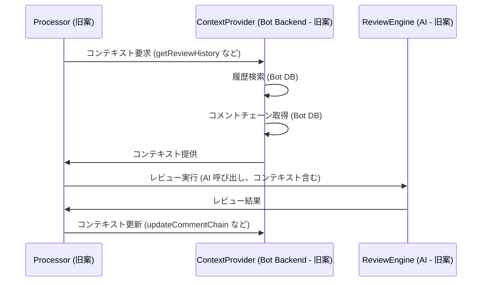

# BaseProcessorのコンテキスト管理拡張仕様 (旧設計案)

**重要:** このドキュメントは、Code Hedgehog の初期設計段階で検討された、`BaseProcessor` が独自のコンテキスト管理機能を持つことを前提とした**古い仕様案**です。現在の設計では、コンテキスト収集は主に `Action Runner` が行い、プロセッサは `IPullRequestProcessor` インターフェースを実装します。

現在のプロセッサ仕様やコンテキスト管理に関する仕様は、以下のドキュメントを参照してください。
-   [GitHub Bot 仕様](../../project-specs/05.github-bot/overview.md)
-   [GitHub Bot: コメント関連機能仕様](../../project-specs/05.github-bot/comment-chain-features.md)
-   [レビューコンテキスト管理仕様 (旧設計案)](../02.core/review-context.md)
-   [コンテキスト管理の仕様 (旧設計案)](../02.core/review-system/context.md)

---

## 1. 概要 (旧設計案)

(旧設計案) `BaseProcessor` に、Bot が内部で管理するコンテキスト (レビュー履歴、コメントチェーン) にアクセス・操作するための機能を追加することを想定していました。

```mermaid
graph TD
    A[BaseProcessor (旧案)] --> B[基本機能 (旧案)]
    A --> C[コンテキスト機能 (旧案)]
    
    B --> D[トリアージ (旧案)]
    B --> E[アスペクト分析 (旧案)]
    B --> F[レビュー実行 (旧案)]
    
    C --> G[履歴管理アクセス (旧案)]
    C --> H[コメントチェーンアクセス (旧案)]
    C --> I[ContextProvider 利用 (旧案)]
```

**現在の設計との違い:** 現在の `BaseProcessor` (存在する場合) は、`Action Runner` から渡されたコンテキスト情報 (`ProcessInput`/`InteractionInput`) を利用するためのヘルパー機能を提供する可能性がありますが、Bot 内部のコンテキスト DB に直接アクセスするような機能は持ちません。

## 2. インターフェース拡張 (旧設計案)

(旧設計案) `BaseProcessor` がコンテキスト管理機能を持つためのインターフェース拡張案です。

### 2.1 コンテキスト対応インターフェース (旧設計案)

(旧設計案) `IContextAwareProcessor` のようなインターフェースを定義し、`ContextProvider` (Bot 内部のコンテキスト管理モジュール) へのアクセスや、履歴・コメントチェーンの直接操作メソッドを想定していました。

```typescript
// 旧設計案のインターフェース
interface IContextAwareProcessor extends IBaseProcessor {
  getContextProvider(): ContextProvider; // Bot 内部モジュールへのアクセス
  getReviewHistory(path: string): Promise<ReviewHistory>; // Bot DB から履歴取得
  getCommentChain(commentId: string): Promise<CommentChain>; // Bot DB からチェーン取得
  updateCommentChain(chain: CommentChain): Promise<void>; // Bot DB のチェーン更新
}
```

**現在の設計との違い:** 現在のプロセッサは `IPullRequestProcessor` を実装します。このインターフェースは `process` と `handleInteraction` メソッドを持ち、引数として `Action Runner` が収集したコンテキスト情報 (`ProcessInput`/`InteractionInput`) を受け取ります。プロセッサが Bot 内部の `ContextProvider` や DB を直接操作することはありません。

### 2.2 既存メソッドの拡張 (旧設計案)

(旧設計案) 旧設計の `BaseProcessor` が持っていた `summarize`, `generateOverallSummary`, `review` メソッド (3段階レビュープロセス) の引数に `ReviewContext` を追加することを想定していました。

```typescript
// 旧設計案のメソッドシグネチャ拡張
abstract class BaseProcessor {
  abstract summarize(..., context?: ReviewContext): Promise<Map<string, SummarizeResult>>;
  abstract generateOverallSummary(..., context?: ReviewContext): Promise<OverallSummary | undefined>;
  abstract review(..., context?: ReviewContext): Promise<IPullRequestProcessedResult>;
}
```

**現在の設計との違い:** 現在の `IPullRequestProcessor` の `process` や `handleInteraction` メソッドは、引数として `ProcessInput` や `InteractionInput` を受け取ります。これらの中に必要なコンテキスト情報 (PR 情報, ファイル差分, コメント履歴など) が含まれています。

## 3. コンテキスト活用の仕組み (旧設計案)

(旧設計案) プロセッサが `ContextProvider` を介してコンテキストを取得・更新するフローを想定していました。

### 3.1 レビューフェーズでのコンテキスト利用 (旧設計案)



**現在の設計との違い:** `Action Runner` が事前に GitHub API からコンテキスト (コメント履歴など) を取得し、`ProcessInput`/`InteractionInput` としてプロセッサに渡します。プロセッサは渡された情報を利用して AI を呼び出し、結果 (`ProcessOutput`/`InteractionOutput`) を `Action Runner` に返します。プロセッサが Bot 内部のコンテキスト DB を更新することはありません。

### 3.2 コンテキストの種類 (旧設計案)

(旧設計案) レビュー履歴、コメントチェーン、ファイルコンテキストなどを Bot が管理・提供することを想定していました。

**現在の設計との違い:** レビュー履歴やコメントチェーンの情報は GitHub API から取得され、`Action Runner` を経由してプロセッサに渡されます。ファイルコンテキスト (依存関係など) の分析は、プロセッサの責務となります。

## 4. 実装ガイドライン (旧設計案)

(旧設計案) 旧設計の3フェーズ (`トリアージ`, `サマリー`, `レビュー`) でコンテキストを活用するためのガイドライン。

**現在の設計との違い:** 現在のプロセッサは `process` メソッド内で、渡されたコンテキスト (`ProcessInput`) を活用してレビューを行います。重複指摘の防止などは、`commentHistory` を参照して実装します。

## 5. パフォーマンス考慮事項 (旧設計案)

(旧設計案) Bot 内部のコンテキスト DB アクセス最適化 (選択的読み込み、キャッシュ) や並行処理について。

**現在の設計との違い:** パフォーマンスの焦点は、GitHub API の効率的な利用、`Action Runner` の処理速度、プロセッサのトークン管理などに移ります。

## 6. エラー処理 (旧設計案)

(旧設計案) Bot 内部のコンテキスト取得エラーや DB の整合性維持について。

**現在の設計との違い:** GitHub API アクセスエラーやプロセッサ内部のエラーハンドリングが中心となります。Bot 独自の DB 整合性を考慮する必要はありません。

## 7. 拡張性 (旧設計案)

(旧設計案) カスタムコンテキストの追加やフィードバックループによる自動学習について。

**現在の設計との違い:** 拡張性はプロセッサの追加・選択や Action ワークフローのカスタマイズで実現します。Bot 自身が自動学習する仕組みは持ちません。