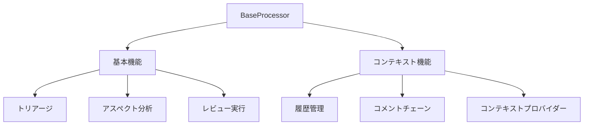
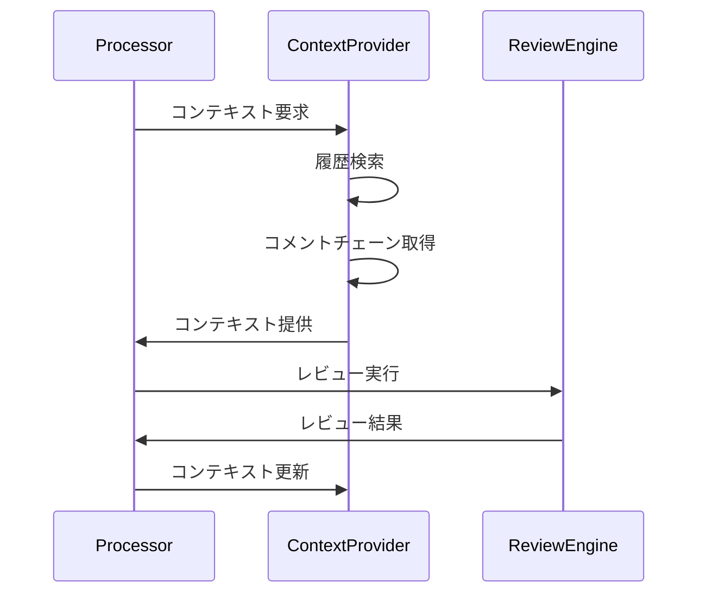

# BaseProcessorのコンテキスト管理拡張仕様

## 1. 概要

BaseProcessorにコンテキスト管理機能を追加し、より高度なレビュー機能を実現します。



## 2. インターフェース拡張

### 2.1 コンテキスト対応インターフェース

```typescript
interface IContextAwareProcessor extends IBaseProcessor {
  // コンテキストプロバイダーの取得
  getContextProvider(): ContextProvider;

  // レビュー履歴の参照
  getReviewHistory(path: string): Promise<ReviewHistory>;

  // コメントチェーンの操作
  getCommentChain(commentId: string): Promise<CommentChain>;
  updateCommentChain(chain: CommentChain): Promise<void>;
}
```

### 2.2 既存メソッドの拡張

```typescript
abstract class BaseProcessor {
  // summarizeの拡張
  abstract summarize(
    prInfo: IPullRequestInfo,
    files: IFileChange[],
    config?: ReviewConfig,
    context?: ReviewContext  // 追加
  ): Promise<Map<string, SummarizeResult>>;

  // generateOverallSummaryの拡張
  abstract generateOverallSummary(
    prInfo: IPullRequestInfo,
    files: IFileChange[],
    summarizeResults: Map<string, SummarizeResult>,
    context?: ReviewContext  // 追加
  ): Promise<OverallSummary | undefined>;

  // reviewの拡張
  abstract review(
    prInfo: IPullRequestInfo,
    files: IFileChange[],
    summarizeResults: Map<string, SummarizeResult>,
    config?: ReviewConfig,
    overallSummary?: OverallSummary,
    context?: ReviewContext  // 追加
  ): Promise<IPullRequestProcessedResult>;
}
```

## 3. コンテキスト活用の仕組み

### 3.1 レビューフェーズでのコンテキスト利用



### 3.2 コンテキストの種類

1. **レビュー履歴コンテキスト**
   - 過去の類似変更
   - 解決済みの指摘
   - 回帰的な問題

2. **コメントチェーンコンテキスト**
   - 進行中の議論
   - 未解決の課題
   - レビューの優先度

3. **ファイルコンテキスト**
   - 関連する変更
   - 影響範囲
   - 依存関係

## 4. 実装ガイドライン

### 4.1 トリアージフェーズ

- 過去のレビュー履歴を考慮したトリアージ
- 類似変更パターンの検出
- コンテキストベースの優先度付け

### 4.2 サマリーフェーズ

- レビュー履歴からのパターン抽出
- コメントチェーンの分析
- アスペクトの動的調整

### 4.3 レビューフェーズ

- コンテキストを考慮したレビュー生成
- 重複指摘の防止
- インテリジェントな提案生成

## 5. パフォーマンス考慮事項

### 5.1 コンテキストの最適化

- 必要なコンテキストの選択的読み込み
- キャッシュ戦略の実装
- メモリ使用量の制御

### 5.2 並行処理の活用

- 非同期コンテキスト読み込み
- バッチ処理の活用
- 優先度ベースの処理順序

## 6. エラー処理

### 6.1 コンテキスト取得エラー

- フォールバック戦略
- 部分的なコンテキスト利用
- エラーレポーティング

### 6.2 整合性の維持

- トランザクション的な更新
- 競合解決メカニズム
- バージョン管理

## 7. 拡張性

### 7.1 カスタムコンテキスト

- プロジェクト固有のコンテキスト
- 外部システムとの連携
- プラグイン機構

### 7.2 フィードバックループ

- レビュー効果の測定
- コンテキスト利用の最適化
- 自動学習メカニズム