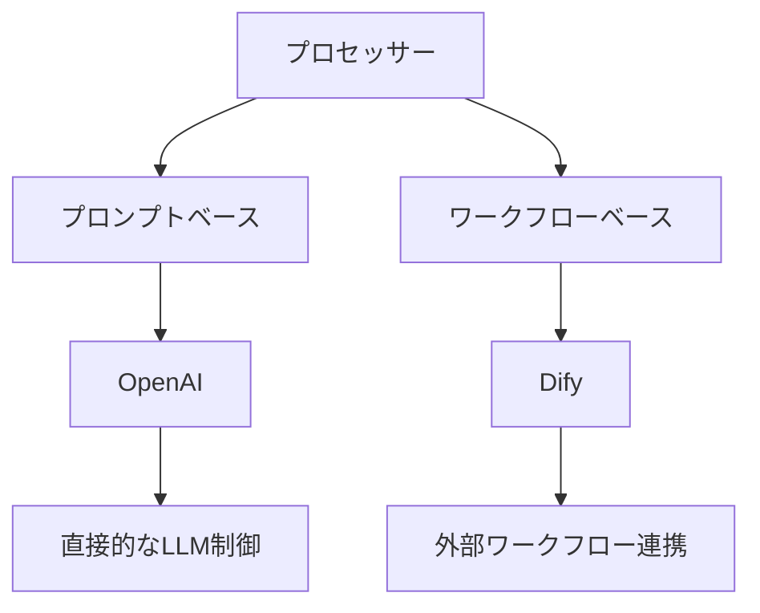

# プロセッサー実装ガイド

## はじめに

Code Hedgehogのプロセッサーは、AIによるコードレビューを実現する重要なコンポーネントです。このガイドでは、プロセッサーを実装する際の選択肢と実装方法について説明します。

## 実装アプローチ

プロセッサーには2つの実装アプローチがあります：



### プロンプトベース（OpenAIProcessor型）

LLMの機能を直接制御する実装方式です。

- **適用場面**
  - 一般的なコードレビュー
  - セキュリティチェック
  - ドキュメントレビュー

- **実装のポイント**
  - APIキーのみで動作可能
  - プロンプトによる直接的な制御
  - LLMの制約を考慮した設計

### ワークフローベース（DifyProcessor型）

外部ワークフローと連携する実装方式です。

- **適用場面**
  - プロジェクト固有のレビュー
  - 社内ナレッジベースとの連携
  - 動的なルール適用

- **実装のポイント**
  - 外部サービスとの連携設定
  - ワークフローの定義と管理
  - 柔軟なルール更新

## レスポンス検証

zodによる型安全なレスポース検証を実装します。

```typescript
// 基本的なレスポーススキーマ
const ResponseSchema = z.object({
  needsReview: z.boolean(),
  reason: z.string(),
  aspects: z.array(z.string())
});
```

各フェーズで以下の検証が必要です：

1. **Summarize Phase**
   - トリアージ結果
   - 初期サマリー

2. **Overall Summary Phase**
   - アスペクトマッピング
   - コンテキスト情報

3. **Review Phase**
   - レビューコメント
   - 改善提案

## エラー処理戦略

エラー発生時は、以下の優先順位で対応します：

1. 部分的な処理継続を試みる
2. 代替処理へのフォールバック
3. エラー情報の明確な記録

主な対応が必要なエラー：

| エラー種別 | 対応方針 | 優先度 |
|------------|----------|---------|
| APIエラー | リトライ | 高 |
| トークン超過 | 分割処理 | 中 |
| 検証エラー | デフォルト値 | 低 |

## 実装のステップ

1. **初期設定**
   - 依存関係の導入
   - 基本クラスの継承
   - 設定の検証

2. **フェーズ実装**
   - Summarize
   - Overall Summary
   - Review

3. **最適化**
   - パフォーマンス改善
   - エラー処理
   - ログ記録

## ベストプラクティス

以下の点に注意して実装してください：

- BaseProcessorの機能を最大限活用
- レスポンスの厳密な型チェック
- 適切なエラーハンドリング
- 明確なログ記録

## テストとデバッグ

効果的なテスト戦略：

1. **単体テスト**
   - 各フェーズの独立テスト
   - エッジケースの検証

2. **統合テスト**
   - エンドツーエンドの確認
   - 実際のPRを使用した検証

3. **パフォーマンステスト**
   - 大規模PRでの動作確認
   - リソース使用量の計測