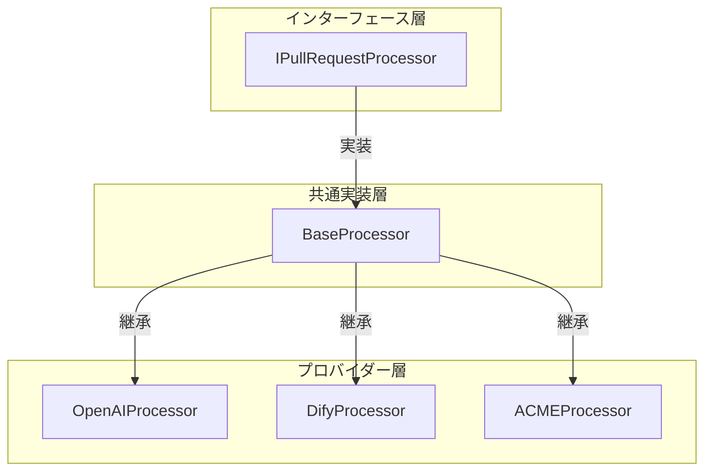

# プロセッサー概要仕様

## プロセッサーの役割

プロセッサーは、Code Hedgehogの中核となるコンポーネントで、異なるAIプロバイダーを統合してコードレビューを実行する機能を提供します。各プロセッサーは共通のインターフェースを実装しながら、プロバイダー固有の最適化を行うことができます。

## アーキテクチャ



## プロセッサーの種類

### 1. BaseProcessor

基本的なプロセッサー実装を提供します：

- トリアージロジック
- トークン管理
- エラーハンドリング
- 共通ユーティリティ

### 2. OpenAIProcessor

OpenAIのGPTモデルを使用したプロセッサー：

- GPT-4による高精度なレビュー
- トークン最適化
- コンテキスト管理

### 3. DifyProcessor

外部ナレッジベースと連携可能な柔軟なプロセッサー：

- カスタムナレッジベースの統合
- 動的なレビュールール
- プロジェクト固有の最適化

### 4. ACMEProcessor

その他のAIプロバイダー用のプロセッサー：

- 新規プロバイダーの統合
- 特殊な要件への対応
- 実験的な機能の実装

## プロセッサーの選択

環境やプロジェクトの要件に応じて適切なプロセッサーを選択します：

1. **OpenAIユーザー**
   - OpenAIのAPIキーが利用可能
   - GPTモデルの特性を活用したい

2. **Difyユーザー**
   - 外部ナレッジベースとの統合が必要
   - カスタムルールの柔軟な適用が必要
   - プロジェクト固有の最適化が必要

3. **その他のユーザー**
   - 特殊な要件がある場合
   - 新しいAIプロバイダーを使用したい場合

## 共通インターフェース

```typescript
interface IPullRequestProcessor {
  /**
   * プルリクエストの処理を実行
   */
  process(
    prInfo: IPullRequestInfo,
    files: IFileChange[],
    config?: ReviewConfig
  ): Promise<IPullRequestProcessedResult>;
}
```

## 処理フロー

各プロセッサーは以下の共通フローに従います：

1. **初期化**
   - 設定の読み込み
   - APIクライアントの初期化
   - リソースの準備

2. **トリアージ**
   - 変更の分析
   - レビュー必要性の判断
   - トークン使用量の見積もり

3. **レビュー実行**
   - AIモデルへのリクエスト
   - レスポンスの解析
   - コメントの生成

4. **最適化**
   - 重複の排除
   - 優先順位付け
   - フォーマットの統一

## エラー処理

各プロセッサーは以下のエラー状況に対応する必要があります：

1. **API関連**
   - レート制限
   - 認証エラー
   - タイムアウト

2. **処理関連**
   - トークン制限超過
   - 無効なレスポンス
   - 予期せぬエラー

## 拡張のガイドライン

新しいプロセッサーを実装する際の指針：

1. **BaseProcessorの継承**
   ```typescript
   class NewProvider extends BaseProcessor {
     // プロバイダー固有の実装
   }
   ```

2. **必要なメソッドの実装**
   - process()の実装
   - エラーハンドリング
   - リソース管理

3. **最適化の考慮**
   - トークン使用量
   - レスポンス品質
   - 処理速度

## プロセッサー間の連携

現時点では、プロセッサー間の直接的な連携は実装されていません。各プロセッサーは独立して動作し、環境に応じて適切なプロセッサーを選択して使用します。