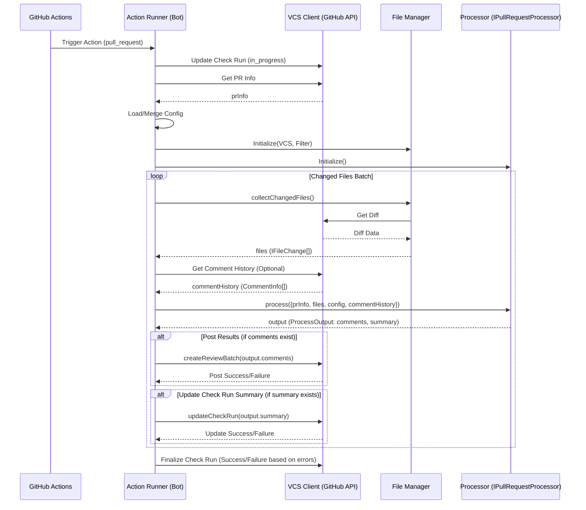

# GitHub Bot 仕様案

## 1. 目的

GitHub と Code Hedgehog コアレビューシステム間のインターフェースとして機能し、GitHub 上での自動コードレビューを実現する。GitHub Bot は、イベントの受信、情報収集、コアシステムの呼び出し、結果の投稿、およびインタラクションを担当する。

## 2. 主要機能 (GitHub Bot の責務範囲)

### 2.1. イベントトリガー

-   **トリガー:** GitHub Actions を利用し、以下のイベントをトリガーとする。
    -   `pull_request`: `opened`, `synchronize` (コード変更時)
    -   `issue_comment`: `created` (コメント投稿時、インタラクション用)
-   **手動トリガー (オプション):**
    -   特定のラベル (`review-request` など) の付与/削除。
    -   特定のコメント (`/review`, `/skip-review` など) の投稿。

### 2.2. 入力情報の収集と整形

-   **基本情報:** トリガーイベントから PR 番号、リポジトリ情報、コミット SHA、コメント情報 (ID, 内容, 投稿者) などを抽出。
-   **差分取得:** GitHub API を使用して、レビュー対象の差分情報 (`IFileChange[]`) を取得。
-   **設定読み込み:** Action の実行コンテキスト (リポジトリ内) から設定ファイル (`.codehedgehog/review.yaml` など) を読み込み、Action の入力設定 (`action.yml` 経由) とマージする。詳細は [パスベース設定システム仕様](./../02.core/path-based-config.md) を参照。
-   **コメント履歴取得:** GitHub API を使用して、PR に存在する既存のレビューコメントを取得し、プロセッサへのコンテキスト (`CommentInfo[]`) として整形する。詳細は [コメント関連機能](./comment-chain-features.md#31-コメント履歴の収集と活用) を参照。
-   **関連情報 (オプション):** 設定に応じて、CI/CD の結果 (Checks API 経由) や関連 Issue の情報を収集。
-   **整形:** 収集した情報をプロセッサが要求する入力形式 (`ProcessInput` または `InteractionInput`) に整形する。

### 2.3. プロセッサの呼び出し

-   整形した入力情報 (`ProcessInput`) を引数として、選択されたプロセッサ (`IPullRequestProcessor` 実装) の `process` メソッドを呼び出す。
-   インタラクションの場合は、整形した入力情報 (`InteractionInput`) を引数として、プロセッサの `handleInteraction` メソッド (実装されていれば) を呼び出す。

### 2.4. 結果の処理と投稿

-   **結果受信:** プロセッサから返される結果 (`ProcessOutput` または `InteractionOutput`) を受け取る。
-   **形式整形:** 結果を GitHub API が要求する形式に整形する。
-   **コメント投稿:**
    -   `ProcessOutput.comments` (`IReviewComment[]`) を GitHub API (VCS クライアント経由) を使用して PR にコメントとして投稿。
    -   **スレッド活用:** GitHub のコメントスレッド (返信) 機能を活用して議論を整理する。詳細は [コメント関連機能](./comment-chain-features.md#32-コメント投稿とスレッド活用) を参照。
-   **Checks API 更新:** `ProcessOutput.summary` があれば、それを使用して GitHub Checks API のサマリーを更新する。
-   **エラー処理:** プロセッサや GitHub API でエラーが発生した場合、エラー内容を PR コメントや Checks API で報告する。

### 2.5. 状態管理

-   **レビュー状況表示 (GitHub Checks API):**
    -   **目的:** レビュープロセスの実行状況をユーザーにリアルタイムでフィードバックする。
    -   **実装:** GitHub Actions のワークフロー開始/終了時に Checks API を更新し、`status` (in_progress, completed) と `conclusion` (success, failure, skipped) を設定する。エラー発生時やスキップ時には `output.summary` に理由を表示する。

-   **指摘解決追跡 (GitHub "Resolve conversation" 連携):**
    -   **目的:** Bot が投稿したレビューコメント (指摘事項) の解決状況を追跡し、PR 全体のレビュー状況を可視化する。
    -   **実装:** GitHub の "Resolve conversation" 機能と連携し、未解決の指摘数を Checks API のサマリーに反映させる。詳細は [コメント関連機能](./comment-chain-features.md#33-指摘解決追跡-resolve-conversation-連携) を参照。
    -   **オプション:** 設定 (`checks.fail_on_unresolved_issues`) により、未解決指摘がある場合に Check Run の `conclusion` を `failure` にすることも可能。

### 2.6. インタラクティブ機能 (`@bot`)

-   **目的:** ユーザーが Bot の指摘に対して質問したり指示を出したりできるようにし、レビュープロセスを対話的にする。
-   **実装:** ユーザーがコメントで `@bot` をメンションすると、専用の GitHub Action がトリガーされ、プロセッサの `handleInteraction` メソッドを呼び出して応答を生成し、元のコメントへの返信として投稿する。詳細は [コメント関連機能](./comment-chain-features.md#34-インタラクティブ機能-bot) を参照。

### 2.7. プロセッサ (コアレビューシステム) との関係

本 GitHub Bot (Action) は、Code Hedgehog の**プロセッサ** (`IPullRequestProcessor` の実装。例: `DifyProcessor`, `OpenaiProcessor`) と連携して動作します。プロセッサは、AI を利用してコードレビューを行い、結果を生成するコアロジックを担当します。

-   **役割分担:**
    -   **GitHub Bot (Action Runner):** GitHub とのインターフェース、イベント処理、コンテキスト収集 (差分、設定、コメント履歴)、プロセッサの選択と呼び出し、結果の投稿 (コメント、Checks API)、状態管理、インタラクションの受付・中継を担当する**インテグレーションレイヤー**。既存の `packages/action/src/runner.ts` を拡張する形で実装します。
    -   **プロセッサ (`IPullRequestProcessor`):** `ProcessInput` (PR情報、差分、設定、コメント履歴) を受け取り、レビューを実行し、`ProcessOutput` (コメントリスト、サマリー) を生成する**エンジン部分**。また、`InteractionInput` を受け取り、`InteractionOutput` (返信内容) を生成する責務も持ちます (オプション)。
-   **連携:** GitHub Bot (Action Runner) は、収集・整形した情報を `ProcessInput` または `InteractionInput` としてプロセッサの `process` または `handleInteraction` メソッドに渡します。

この構成により、GitHub Bot (Action Runner) は GitHub との連携処理に専念し、プロセッサはレビューロジックや AI との連携に集中できます。

## 3. アーキテクチャ概要 (Bot中心)

```mermaid
graph TD
    A[GitHub Actions Event (PR, Comment)] --> B[Action Runner (Bot)];
    B --> C[VCS Client (GitHub API)];
    B --> D[File Manager];
    B --> E[Processor (IPullRequestProcessor)];
    C -- Fetches PR Info, Diff, Comments, Posts Comments, Updates Checks --> G[GitHub API];
    D -- Uses VCS Client --> C;
    D -- Collects Files --> B;
    E -- Executes Review/Interaction --> B;

    subgraph "GitHub"
        A
        G
    end

    subgraph "GitHub Action Runner Environment"
        B
        C
        D
        E
    end

    subgraph "Code Hedgehog Core/Processors"
        E
    end
```

-   **Action Runner (Bot):** GitHub Actions 上で動作 (`packages/action/src/runner.ts` ベース)。イベント処理、情報収集、コンポーネント初期化、プロセッサ呼び出し、結果投稿、状態管理、インタラクション処理。
-   **VCS Client (GitHub API):** GitHub API との通信担当 (`@code-hedgehog/core` の `createVCS` で生成)。差分取得、コメント投稿、Checks API 操作など。
-   **File Manager:** 変更ファイルの収集とフィルタリング (`@code-hedgehog/core` の `FileManager`)。
-   **Processor (`IPullRequestProcessor`):** レビュー実行とインタラクション処理のコアロジック (`packages/processors/*`)。

## 4. 処理フロー概要 (Bot視点 - 通常レビュー)



## 5. 処理フロー概要 (Bot視点 - インタラクション)

```mermaid
sequenceDiagram
    participant User
    participant GitHub
    participant GA as GitHub Actions (New Entrypoint)
    participant Runner as Action Runner (Bot)
    participant VCS as VCS Client (GitHub API)
    participant Proc as Processor (IPullRequestProcessor)

    User->>GitHub: Post Comment (@bot explain)
    GitHub->>GA: Trigger Action (issue_comment)
    GA->>Runner: Start Action
    Runner->>Runner: Parse Comment (userInstruction, targetCommentId)
    Runner->>VCS: Get Comment Details (targetComment)
    VCS-->>Runner: targetComment (CommentInfo)
    Runner->>VCS: Get PR Info, Related Diff, History (Optional)
    VCS-->>Runner: prInfo, diff, commentHistory
    Runner->>Runner: Load/Merge Config
    Runner->>Proc: Initialize()

    alt If processor supports interaction (handleInteraction exists)
        Runner->>Proc: handleInteraction({prInfo, userInstruction, targetComment, config, diff, commentHistory})
        Proc-->>Runner: output (InteractionOutput: replyBody)
        Runner->>VCS: postReplyComment(targetComment.id, output.replyBody)
        VCS-->>Runner: Post Success/Failure
    else
        Runner->>VCS: postReplyComment(targetComment.id, "Interaction not supported by this processor.")
        VCS-->>Runner: Post Success/Failure
    end