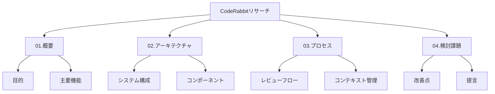

# CodeRabbitリサーチドキュメント構成の改善提案

## 1. 現状の課題

### 1.1 ドキュメントの分散
- フロー関連の文書が複数に分割（02-1〜02-4）
- コンテキスト関連の情報が複数文書に散在
- 一部内容に重複がある

### 1.2 トピックの関連性
- フローとコンテキスト管理の密接な関係
- コメントチェーンとコンテキスト管理の重複
- 重複防止とフロー制御の関連

## 2. 改善提案

### 2.1 新構成案



### 2.2 ファイル構成

```
docs/research/coderabbit-ai-pr-reviewer/
├── 01.overview.md               # システム概要
├── 02.architecture.md          # アーキテクチャ詳細
├── 03.process/                 # プロセス関連
│   ├── 01.review-flow.md      # レビューフロー統合
│   ├── 02.context.md          # コンテキスト管理統合
│   └── 03.error-handling.md   # エラー処理
└── 04.findings.md             # 検討課題と提言
```

## 3. 文書の統合方針

### 3.1 フロー関連文書の統合

現在の文書：
- 02-1.flow.md
- 02-2.flow-basis.md
- 02-3.flow-event.md
- 02-4.flow-error.md

統合方針：
1. **基本フローとイベント処理の統合**
   - 処理の流れを一貫して説明
   - イベントをフローの一部として記述
   - 図解による視覚化の強化

2. **エラー処理の分離維持**
   - エラー処理の重要性を考慮
   - 横断的な課題として扱う
   - 実装指針としての価値を保持

### 3.2 コンテキスト関連文書の統合

現在の文書：
- 03.context-management.md
- 04.comment-chain.md

統合方針：
1. **コンテキスト管理の包括的な記述**
   - コメントチェーンをコンテキストの一部として説明
   - 階層構造の明確化
   - インターフェースの一元化

2. **重複防止との関連付け**
   - コンテキストを活用した重複防止の説明
   - 履歴管理との統合
   - 効率化メカニズムの説明

## 4. 移行手順

### 4.1 フェーズ1：基本構造の確立
1. 新しいディレクトリ構造の作成
2. overview.mdの作成
3. architecture.mdの更新

### 4.2 フェーズ2：フロー文書の統合
1. review-flow.mdの作成
2. 既存フロー文書からの内容移行
3. 図解の更新と統合

### 4.3 フェーズ3：コンテキスト文書の統合
1. context.mdの作成
2. コメントチェーン情報の統合
3. 重複防止メカニズムの関連付け

### 4.4 フェーズ4：最終調整
1. 相互参照の更新
2. 内容の重複チェック
3. 最終レビュー

## 5. 期待される効果

1. **可読性の向上**
   - 論理的な文書構造
   - 関連情報の集約
   - 重複の排除

2. **メンテナンス性の改善**
   - 更新箇所の明確化
   - 一貫性の維持
   - バージョン管理の容易化

3. **活用性の向上**
   - 情報の検索性向上
   - 実装への反映が容易
   - レビュープロセスの効率化

## 6. 次のステップ

1. **レビューと承認**
   - 構成案の確認
   - 内容の妥当性確認
   - 移行計画の承認

2. **実施計画の詳細化**
   - タスクの優先順位付け
   - リソースの割り当て
   - スケジュールの策定

3. **移行作業の開始**
   - 新規文書の作成
   - 既存内容の移行
   - レビューと調整