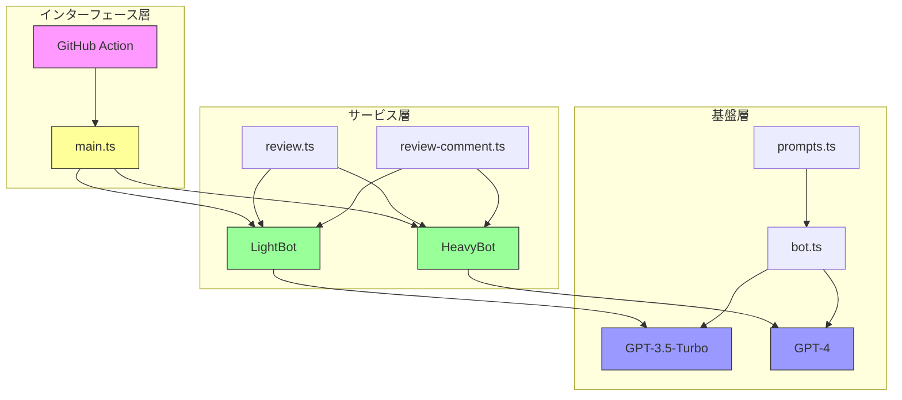

# CodeRabbitアーキテクチャ解説

## 1. システム概要

CodeRabbitは、GitHubのプルリクエストに対してAIによるコードレビューを自動化するシステムです。OpenAIのGPTモデルを活用し、コードの変更内容を分析、要約し、改善提案を行います。

### 主な特徴
- コードレビューの自動化
- 変更内容の要約生成
- 改善提案の提示
- AIとの対話機能

## 2. アーキテクチャ概要

アーキテクチャは以下の3層で構成されています：

### 各層の責務

1. **インターフェース層**
   - GitHubイベントの受信
   - アクション実行の制御
   - 結果のフィードバック

2. **サービス層**
   - レビュー処理の実行
   - 要約生成の管理
   - Bot動作の制御

3. **基盤層**
   - OpenAI APIとの通信
   - プロンプト管理
   - エラーハンドリング

## 3. コアコンポーネント

### main.ts
- アプリケーションのエントリーポイント
- GitHubイベントのハンドリング
- Botインスタンスの初期化と管理

### bot.ts
- OpenAI APIとの通信制御
- レスポンス処理
- エラー制御とリトライ

### review.ts
- コードレビューのロジック実装
- 差分分析と要約生成
- レビューコメントの生成

### review-comment.ts
- コメント処理の管理
- 対話形式の応答生成
- コメントチェーンの追跡

### prompts.ts
- AIへの指示プロンプト管理
- コンテキスト制御
- 応答フォーマットの定義

## 4. 処理の特徴

### Botの使い分け
- **LightBot (GPT-3.5-Turbo)**
  - 軽量な要約タスク
  - 簡易な変更の確認
  - 高速なレスポンス

- **HeavyBot (GPT-4)**
  - 詳細なコードレビュー
  - 複雑な分析
  - 高度な推論

### エラー制御
- APIレート制限の管理
- リトライ処理の実装
- トークン制限の制御

## 5. 主要な依存関係

### GitHub関連
- @actions/core
- @actions/github
- @octokit/*

### OpenAI関連
- @dqbd/tiktoken (トークン計算)

### ユーティリティ
- p-limit (並行処理制御)
- p-retry (再試行処理)

これらのコンポーネントが連携して、効率的なAIベースのコードレビューシステムを実現しています。
