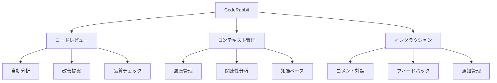
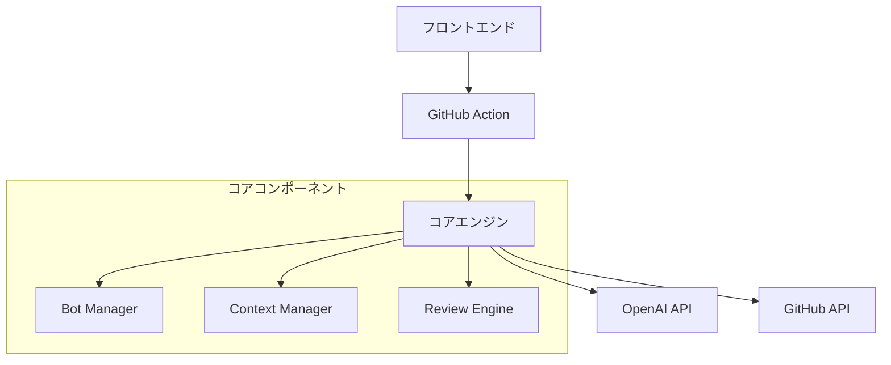

# CodeRabbitシステム概要

## 1. システムの目的

CodeRabbitは、GitHubのプルリクエストに対して効率的かつ高品質なAIレビューを提供するシステムです。

### 1.1 主要な目標

1. **レビュー品質の向上**
   - コンテキストを考慮した分析
   - 一貫性のある指摘
   - 重複の防止

2. **効率性の実現**
   - インクリメンタルな処理
   - リソースの最適利用
   - 自動化された workflow

3. **拡張性の確保**
   - プラグイン可能なアーキテクチャ
   - カスタマイズ可能なレビュー基準
   - 外部システムとの連携

## 2. 主要機能

### 2.1 コードレビュー機能

1. **自動レビュー**
   - 差分の分析
   - コード品質の評価
   - 改善提案の生成

2. **インクリメンタル処理**
   - 変更の追跡
   - 重複の防止
   - 効率的な更新

3. **最適化機能**
   - トークン使用の制御
   - 並行処理の活用
   - キャッシュの利用

### 2.2 コンテキスト管理

1. **履歴管理**
   - レビュー履歴の追跡
   - 変更の連続性把握
   - パターンの認識

2. **関連性分析**
   - ファイル間の関係
   - 変更の影響範囲
   - 依存関係の把握

3. **知識ベース**
   - ベストプラクティス
   - 共通パターン
   - 解決策の蓄積

### 2.3 インタラクション機能

1. **コメント管理**
   - 階層的な構造
   - 対話の追跡
   - 解決状態の管理

2. **フィードバック**
   - 改善提案の提示
   - 説明の生成
   - 対話的な応答

## 3. 技術的特徴

### 3.1 アーキテクチャの特徴

1. **3層アーキテクチャ**
   - インターフェース層
   - サービス層
   - 基盤層

2. **モジュール化**
   - 独立したコンポーネント
   - 明確なインターフェース
   - プラグイン機構

### 3.2 実装の特徴

1. **効率的な処理**
   - 非同期処理
   - バッチ処理
   - キャッシュ戦略

2. **スケーラビリティ**
   - 水平スケーリング
   - 負荷分散
   - リソース最適化

3. **信頼性**
   - エラー処理
   - リトライ機構
   - 状態管理

## 4. 統合ポイント

### 4.1 GitHub連携

1. **イベント処理**
   - PRイベントの受信
   - コメントの管理
   - 状態の同期

2. **APIインテグレーション**
   - レート制限の管理
   - 認証・認可
   - データアクセス

### 4.2 OpenAI連携

1. **モデル活用**
   - GPT-3.5/4の使い分け
   - プロンプト管理
   - トークン最適化

2. **応答制御**
   - 品質管理
   - フォーマット制御
   - エラー処理

## 5. 拡張性と制限事項

### 5.1 拡張ポイント

1. **カスタマイズ**
   - レビュールール
   - プロンプト設定
   - 出力フォーマット

2. **インテグレーション**
   - CI/CDパイプライン
   - 外部ツール
   - 通知システム

### 5.2 制限事項

1. **リソース制限**
   - トークン上限
   - APIレート制限
   - 処理時間制約

2. **機能制限**
   - 対応言語
   - ファイルサイズ
   - 同時処理数

## 6. 今後の展望

1. **機能拡張**
   - 言語サポートの拡大
   - 分析機能の強化
   - UI/UXの改善

2. **最適化**
   - パフォーマンス向上
   - リソース効率化
   - 精度の改善

3. **統合強化**
   - 外部サービス連携
   - ワークフロー自動化
   - データ分析機能