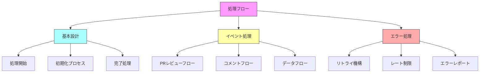

# CodeRabbit処理フロー

CodeRabbitの処理フローは、効率的で信頼性の高いコードレビューを実現するための基盤となります。このドキュメントでは、処理フローの全体像を以下の3つの文書に分けて説明します。

## ドキュメント構成

## ドキュメント詳細

### 1. [基本設計](./02-2.flow-basis.md)
- GitHub Action開始時の処理フロー
- システムとBotの初期化
- 処理の正常/エラー完了

### 2. [イベント処理詳細](./02-3.flow-event.md)
- プルリクエストの処理パス
- コメント対応の処理パス
- 各処理時のデータフロー

### 3. [エラー処理フロー](./02-4.flow-error.md)
- エラー時の自動リトライ
- API制限への対応
- エラー情報の管理

これらのドキュメントにより、CodeRabbitの処理フローを体系的に理解することができます。
