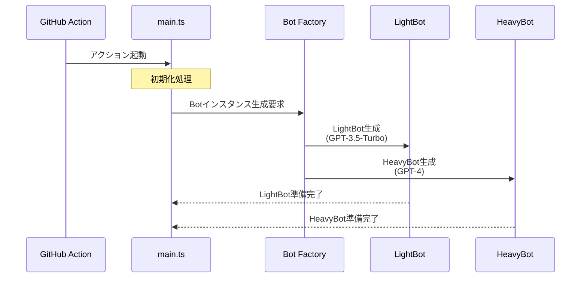

# CodeRabbit処理フロー基本設計

## 1. 処理の開始点

GitHub Actionがトリガーされると、CodeRabbitの処理が以下の流れで開始されます：

## 2. 初期化プロセス

### システム初期化
- `Options`クラスによる設定値の読み込み
- `Prompts`クラスによるプロンプトテンプレートの初期化
- APIクライアントの設定（GitHub、OpenAI）

### Bot初期化
- LightBot：軽量な要約タスク用
- HeavyBot：詳細なレビュー用
- エラーハンドリングの設定
- レート制限の設定

## 3. 処理の完了

各処理パスは以下のいずれかの状態で完了します：

### 正常完了
- レビュー/コメントの投稿成功
- 処理結果のログ記録
- クリーンアップ処理

### エラー完了
- エラー内容の記録
- 可能な場合の回復処理
- エラー通知の生成

これらの処理により、効率的で信頼性の高いコードレビューと対話が実現されています。
