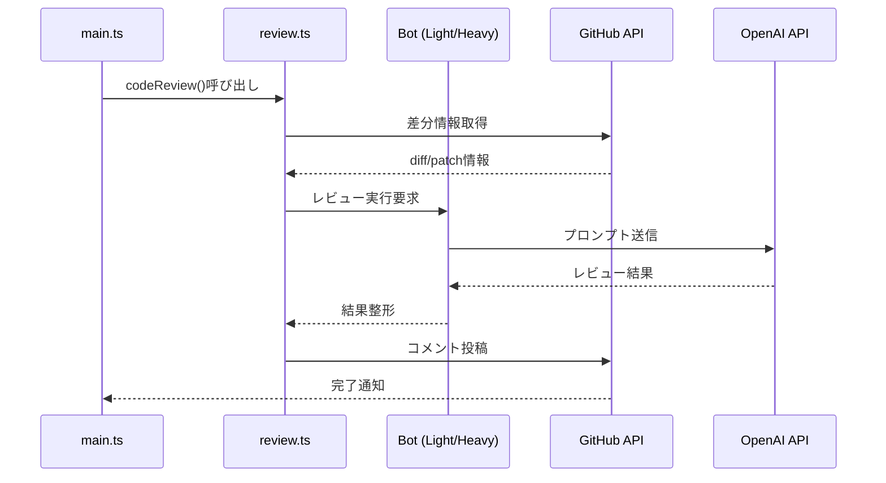
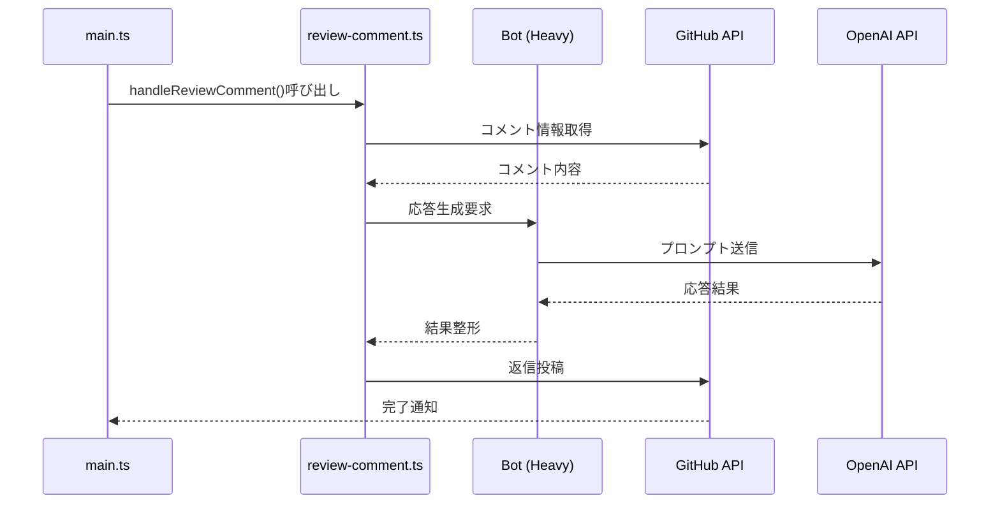

# CodeRabbitイベント処理詳細

## 1. イベント処理フロー

処理はイベントタイプにより2つのパスに分岐します：

### プルリクエストパス

### コメントパス

## 2. データの流れ

### プルリクエスト処理時
1. GitHub APIから差分情報取得
2. 差分の解析と構造化
3. レビュー用プロンプトの生成
4. OpenAI APIでの処理
5. レビューコメントの生成
6. GitHubへのフィードバック

### コメント処理時
1. コメント内容の取得
2. コンテキストの収集
3. 応答用プロンプトの生成
4. OpenAI APIでの処理
5. 返信内容の生成
6. GitHubへの投稿

この処理フローにより、効率的で信頼性の高いコードレビューと対話が実現されています。
