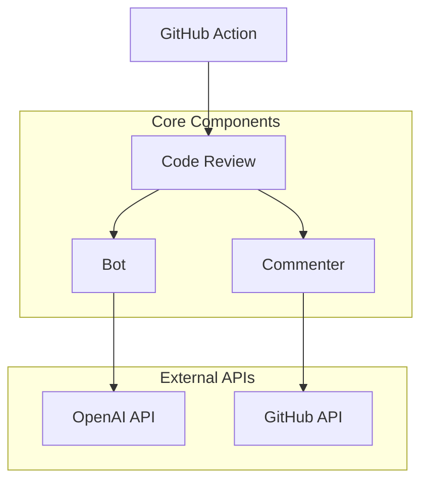
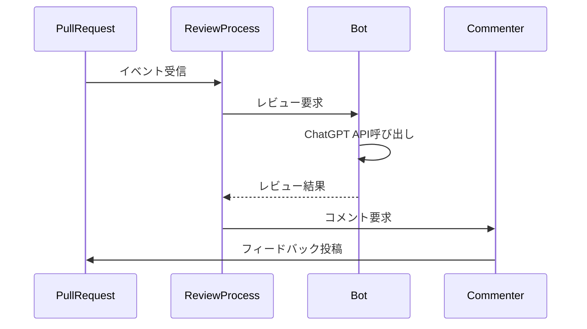

# CodeRabbitアーキテクチャ詳細

## 1. システム構成

CodeRabbitは、以下の主要コンポーネントで構成されています：

## 2. 主要コンポーネント

### 2.1 レビュー処理（src/review.ts）

レビューの中心的な処理を担当：
- プルリクエストの差分取得
- インクリメンタルレビューの制御
- ファイルのフィルタリング
- 並行処理の制御

### 2.2 Bot管理（src/bot.ts）

OpenAI APIとの対話を管理：
- ChatGPT APIの初期化と設定
- プロンプト管理
- トークン制限の制御
- エラー処理とリトライ

### 2.3 コメント管理（src/commenter.ts）

GitHubとの対話を担当：
- レビューコメントの作成
- 履歴の追跡
- コンテキスト管理
- コメントの更新

## 3. 主要な依存関係

### 3.1 外部API
- OpenAI API（ChatGPT）
- GitHub API（Octokit）

### 3.2 主要ライブラリ
- chatgpt: OpenAI APIクライアント
- @actions/github: GitHub Actions連携
- @actions/core: アクション制御
- p-limit: 並行処理制御

## 4. 処理フロー

### 4.1 レビュープロセス

### 4.2 インクリメンタル処理

- 最後にレビューしたコミットの追跡
- 差分ベースのレビュー
- 重複防止の制御

## 5. データ管理

### 5.1 コンテキスト情報
- プルリクエストの情報
- コミット履歴
- レビューコメント
- 設定情報

### 5.2 設定管理
- OpenAI API設定
- GitHub API設定
- レビュー対象のパス制御
- 並行処理の制限

## 6. エラー処理

### 6.1 主要なエラー対応
- API制限の管理
- トークン制限の制御
- タイムアウト処理
- リトライ制御

### 6.2 状態管理
- レビュー状態の追跡
- エラー状態の管理
- リソース使用の監視

## 7. 拡張性

### 7.1 カスタマイズポイント
- プロンプトの調整
- レビュー対象の制御
- フィードバックの形式

### 7.2 将来の拡張
- 新しいAIモデルの統合
- 追加のチェック機能
- カスタムルールの適用