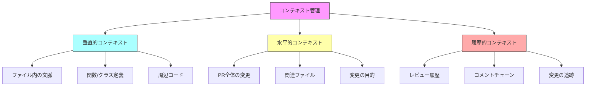
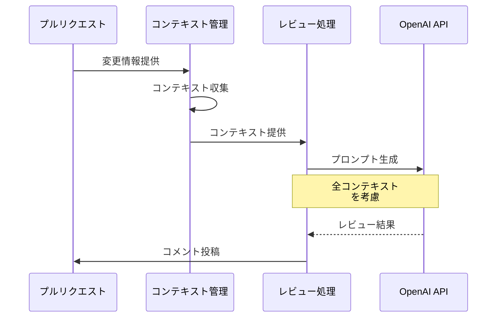

# CodeRabbitコンテキスト管理解説

## 1. コンテキスト管理の概要

CodeRabbitは、より効果的なコードレビューを実現するため、多角的なコンテキスト管理を行っています。これにより、単なるdiffの確認を超えた、包括的なコードレビューを実現します。



## 2. コンテキスト収集システム

### 2.1 差分情報の取得
```typescript
const targetBranchDiff = await octokit.repos.compareCommits({
  base: context.payload.pull_request.base.sha,
  head: context.payload.pull_request.head.sha
})
```

### 2.2 ファイル内容の取得
```typescript
const contents = await octokit.repos.getContent({
  path: file.filename,
  ref: context.payload.pull_request.base.sha
})
```

### 2.3 コメント履歴の取得
```typescript
const allChains = await commenter.getCommentChainsWithinRange(
  pull_request.number,
  filename,
  startLine,
  endLine,
  COMMENT_REPLY_TAG
)
```

## 3. コンテキストの種類と役割

### 3.1 垂直的コンテキスト
コードファイル内での文脈理解を支援します。

- **スコープ**
  - 変更された行の前後のコード
  - 関数やクラスの完全な定義
  - ファイル内の依存関係

- **目的**
  - コードの意図の理解
  - ローカルな影響の分析
  - 実装の整合性確認

### 3.2 水平的コンテキスト
関連する変更全体を把握します。

- **スコープ**
  - PR全体の変更概要
  - 関連するファイルの変更
  - 変更の意図や目的

- **目的**
  - 変更の全体像の把握
  - ファイル間の整合性確認
  - 影響範囲の特定

### 3.3 履歴的コンテキスト
変更の経緯と進行状況を追跡します。

- **スコープ**
  - 過去のレビューコメント
  - 議論の経緯
  - 変更の進捗状況

- **目的**
  - レビュー履歴の維持
  - 議論の文脈理解
  - インクリメンタルな改善

## 4. コンテキストの利用

### 4.1 レビュー時のコンテキスト統合



### 4.2 プロンプトでのコンテキスト利用

```typescript
// レビュープロンプトの構成例
reviewPrompt = `
## PR Context
${pr.title}
${pr.description}

## File Changes Overview
${summary}

## Current File
${filename}

## Relevant Changes
${patches}

## Previous Reviews
${commentHistory}
`
```

## 5. コンテキスト管理の利点

### 5.1 レビュー品質の向上
- より深い理解に基づくレビュー
- 関連する問題の早期発見
- 一貫性のある提案

### 5.2 効率的なレビュー
- 重要な変更への焦点化
- 文脈を考慮した判断
- 重複した指摘の防止

### 5.3 継続的な改善
- 過去の議論の活用
- インクリメンタルな修正
- レビュー履歴の維持

## 6. 制限事項と考慮点

### 6.1 トークン制限
- コンテキスト量の調整
- 重要度に基づく選択
- 効率的な情報圧縮

### 6.2 処理の最適化
- 必要なコンテキストの選択
- キャッシュの活用
- 並行処理の活用

このように、CodeRabbitは多面的なコンテキスト管理により、より効果的なコードレビューを実現しています。
