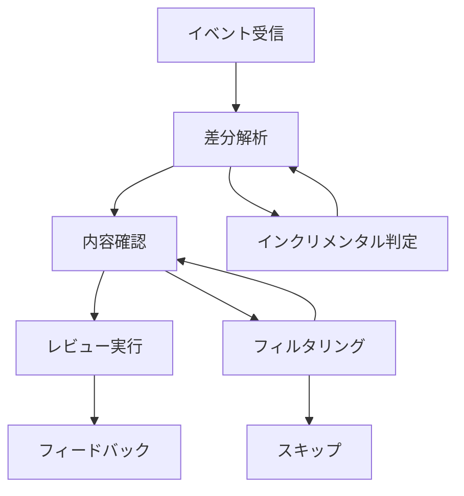

# レビューフロープロセス

## 1. プロセス概要

CodeRabbitのレビュープロセスは、効率的かつ正確なコードレビューを実現するために、段階的なアプローチを採用しています。このプロセスは、単なるコードの差分チェックを超えて、コンテキストを考慮した包括的なレビューを提供します。

以下の図は、レビュープロセスの基本的な流れを示しています：



このフローにより、以下のような利点が実現されます：
- 効率的なリソース利用
- レビュー品質の一貫性
- スケーラブルな処理

## 2. イベント処理

### 2.1 イベントの受信

プルリクエストの作成や更新時に、システムは適切なイベントを受信し、処理を開始します：

```typescript
// プルリクエストイベントの確認
if (context.eventName !== 'pull_request' && 
    context.eventName !== 'pull_request_target') {
  warning(`Skipped: current event is ${context.eventName}`);
  return;
}
```

このチェックにより、以下を確実にします：
- 適切なイベントのみを処理
- リソースの効率的な利用
- 不要な処理の回避

### 2.2 初期チェックと検証

システムは、レビュー開始前に以下の重要な検証を行います：

1. **プルリクエストの妥当性確認**
   - プルリクエストの存在確認
   - 必要なメタデータの検証
   - アクセス権限の確認
2. **無視条件のチェック**
   - 特定のキーワードの検出
   - 除外パターンの確認
   - スキップ条件の評価

3. **基本情報の収集**
   - タイトルと説明の取得
   - 関連するラベルの確認
   - 参照情報の収集

## 3. 差分処理

### 3.1 差分の取得と分析

システムは、2種類の差分を効率的に管理します：

```typescript
// インクリメンタル差分の取得
const incrementalDiff = await octokit.repos.compareCommits({
  base: highestReviewedCommitId,
  head: context.payload.pull_request.head.sha
});

// 全体差分の取得
const targetBranchDiff = await octokit.repos.compareCommits({
  base: context.payload.pull_request.base.sha,
  head: context.payload.pull_request.head.sha
});
```

この2段階のアプローチにより：
- 効率的な差分処理
- 重複レビューの防止
- 変更の追跡性の向上
が実現されます。

### 3.2 ファイルの選別と最適化

レビュー対象のファイルは、以下の基準で慎重に選別されます：

1. **パスベースのフィルタリング**
   - 設定に基づく対象判定
   - 重要度による選択
   - 除外パターンの適用

2. **サイズと複雑さの評価**
   - ファイルサイズの確認
   - 変更量の評価
   - 処理の優先順位付け

3. **リソース最適化**
   - 並行処理の調整
   - メモリ使用の制御
   - 処理順序の最適化

## 4. コンテンツ分析

### 4.1 ファイル内容の詳細分析

システムは、各ファイルについて以下の詳細な分析を行います：

1. **ベース内容の取得**
   - 元のコードの取得
   - コンテキストの収集
   - 依存関係の分析

2. **差分の構造化**
   - 変更箇所の特定
   - 影響範囲の評価
   - 関連性の分析

3. **コメントチェーンの活用**
   ```typescript
   const allChains = await commenter.getCommentChainsWithinRange(
     context.payload.pull_request.number,
     filename,
     startLine,
     endLine,
     COMMENT_REPLY_TAG
   );
   ```

   この機能により：
   - 過去の議論の参照と活用
   - 重複した議論の防止
   - レビューの文脈維持

### 4.2 パッチの詳細処理

パッチ情報は以下のように構造化されます：

```typescript
// パッチの解析と構造化
const patches = [];
for (const patch of splitPatch(file.patch)) {
  const patchLines = patchStartEndLine(patch);
  const hunks = parsePatch(patch);
  if (hunks) {
    patches.push([
      patchLines.newHunk.startLine,
      patchLines.newHunk.endLine,
      formatHunks(hunks)
    ]);
  }
}
```

この処理により：
- 変更の正確な位置特定
- コンテキストの保持
- レビューの効率化
が実現されます。

## 5. レビュー実行

### 5.1 サマリー生成プロセス

レビューの初期段階として、変更の全体像を把握するためのサマリーを生成します：

1. **初期分析プロセス**
   ```typescript
   const doSummary = async (
     filename: string,
     fileContent: string,
     fileDiff: string
   ): Promise<[string, string, boolean] | null>
   ```
   この処理により：
   - 各ファイルの概要把握
   - レビュー必要性の判断
   - 効率的なリソース配分

2. **選択的レビュー**
   ```typescript
   const filesAndChangesReview = filesAndChanges.filter(([filename]) => {
     const needsReview = summaries.find(
       ([summaryFilename]) => summaryFilename === filename
     )?.[2] ?? true;
     return needsReview;
   });
   ```

3. **要約処理の最適化**
   - ファイルごとの変更概要作成
   - 全体的な変更の意図の抽出
   - リリースノート形式での整理

レビューの初期段階として、変更の全体像を把握するためのサマリーを生成します：

1. **トークン管理の重要性**
   - プロンプトの最適化：AIモデルの制限を考慮した効率的な情報伝達
   - サイズ制御：処理可能な範囲での情報量の調整
   - 分割戦略：大規模な変更の効率的な処理

2. **要約処理の詳細**
   - ファイルごとの変更概要作成
   - 全体的な変更の意図の抽出
   - リリースノート形式での整理

### 5.2 詳細レビューの実施

レビューの実行は、以下の要素を考慮して最適化されます：

1. **リソース管理**
   ```typescript
   // 並行処理の制御
   const openaiConcurrencyLimit = pLimit(options.openaiConcurrencyLimit);
   const githubConcurrencyLimit = pLimit(options.githubConcurrencyLimit);
   ```

2. **レビュー品質の最適化**
   - 重複チェックによる効率化
   - コンテキストを活用した精度向上
   - 優先順位に基づく処理

## 6. フィードバック管理

### 6.1 効果的なコメント生成

レビュー結果は、以下の形式で提供されます：

1. **インラインコメント**
   - 具体的な改善提案
   - コンテキストを考慮した説明
   - 関連する参照情報

2. **サマリーコメント**
   - 変更全体の評価
   - 主要な改善ポイント
   - 次のステップの提案

3. **リリースノート生成**
   ```typescript
   if (options.disableReleaseNotes === false) {
     const [releaseNotesResponse] = await heavyBot.chat(
       prompts.renderSummarizeReleaseNotes(inputs),
       {}
     );
     if (releaseNotesResponse !== '') {
       let message = '### Summary by CodeRabbit\n\n';
       message += releaseNotesResponse;
       await commenter.updateDescription(
         context.payload.pull_request.number,
         message
       );
     }
   }
   ```
   
   この機能により：
   - 変更の自動文書化
   - レビュー結果の要約
   - メンテナンス性の向上

レビュー結果は、以下の形式で提供されます：

1. **インラインコメント**
   - 具体的な改善提案
   - コンテキストを考慮した説明
   - 関連する参照情報

2. **サマリーコメント**
   - 変更全体の評価
   - 主要な改善ポイント
   - 次のステップの提案

### 6.2 状態管理と追跡

```typescript
// コメントの更新処理
await commenter.comment(
  formatComment(review),
  COMMENT_TAG,
  'create'
);
```

この処理により：
- コメントの一貫性維持
- 履歴の追跡
- 状態の管理
が実現されます。

## 7. エラー処理と回復

### 7.1 包括的なエラー管理

システムは以下のようなエラーに対応します：

1. **API関連の課題**
   - レート制限の管理と対応
   - 認証エラーのハンドリング
   - タイムアウトの制御

2. **処理上の問題**
   - パース処理の失敗対応
   - トークン制限の管理
   - 並行処理のエラー制御

### 7.2 効果的なリカバリー

システムは以下の戦略でエラーから回復します：

1. **段階的なリトライ**
   - バックオフ戦略の適用
   - 代替処理パスの提供
   - 部分的な処理の継続

2. **状態の保持**
   - チェックポイントの活用
   - 進捗の記録
   - 復旧ポイントの管理

## 8. 処理の最適化

### 8.1 インクリメンタル処理の詳細

効率的なレビューのために、以下の最適化を実施します：

1. **変更の追跡**
   - コミット履歴の管理
   - 差分の効率的な特定
   - レビュー範囲の最適化

2. **状態の維持**
   - 処理済み箇所の記録
   - 増分更新の実現
   - キャッシュの効果的活用

### 8.2 リソースの効率的管理

システムは以下のようにリソースを管理します：

1. **トークンの使用制御**
   ```typescript
   // トークン制限のチェック
   if (tokens + patchTokens > options.heavyTokenLimits.requestTokens) {
     info(
       `only packing ${patchesToPack} / ${patches.length} patches, tokens: ${tokens}`
     );
     break;
   }
   ```

2. **バッチ処理の最適化**
   ```typescript
   const batchSize = 10;
   for (let i = 0; i < summaries.length; i += batchSize) {
     const summariesBatch = summaries.slice(i, i + batchSize);
     // バッチ処理の実行
   }
   ```

3. **リソース配分**
   - 並行度の動的調整
   - 優先順位に基づく実行
   - メモリ使用の最適化

## 9. システムの拡張性

### 9.1 カスタマイズ機能

システムは以下の拡張ポイントを提供します：

1. **レビュールールの管理**
   - カスタムルールの追加
   - 既存ルールの調整
   - 優先順位の設定

2. **処理のカスタマイズ**
   - フィルタリング条件の定義
   - 出力形式の調整
   - 通知設定の管理

### 9.2 外部システムとの統合

以下のような統合ポイントを提供します：

1. **CI/CD連携**
   - ビルド結果の統合
   - テスト情報の活用
   - デプロイ状態の反映

2. **モニタリングと分析**
   - メトリクスの収集
   - パフォーマンスの追跡
   - 品質指標の測定

## 10. 高度なレビュー機能

### 10.1 段階的なレビュープロセス

システムは、以下のような段階的なアプローチでレビューを実行します：

1. **初期分析**
   ```typescript
   const doSummary = async (
     filename: string,
     fileContent: string,
     fileDiff: string
   ): Promise<[string, string, boolean] | null>
   ```
   この段階で、各ファイルの概要を把握し、詳細レビューの必要性を判断します。

2. **選択的レビュー**
   ```typescript
   // 必要なファイルのみを詳細レビュー
   const filesAndChangesReview = filesAndChanges.filter(([filename]) => {
     const needsReview = summaries.find(
       ([summaryFilename]) => summaryFilename === filename
     )?.[2] ?? true;
     return needsReview;
   });
   ```

### 10.2 リリースノート生成

プルリクエストの説明を自動的に強化します：

```typescript
if (options.disableReleaseNotes === false) {
  const [releaseNotesResponse] = await heavyBot.chat(
    prompts.renderSummarizeReleaseNotes(inputs),
    {}
  );
  if (releaseNotesResponse !== '') {
    let message = '### Summary by CodeRabbit\n\n';
    message += releaseNotesResponse;
    await commenter.updateDescription(
      context.payload.pull_request.number,
      message
    );
  }
}
```

この機能により：
- 変更の自動文書化
- レビュー結果の要約
- メンテナンス性の向上

### 10.3 コメントチェーンの活用

レビューの文脈を維持するため、既存のコメントチェーンを活用します：

```typescript
const allChains = await commenter.getCommentChainsWithinRange(
  context.payload.pull_request.number,
  filename,
  startLine,
  endLine,
  COMMENT_REPLY_TAG
);

if (allChains.length > 0) {
  info(`Found comment chains: ${allChains} for ${filename}`);
  commentChain = allChains;
}
```

この機能により：
1. **文脈の継続性**
   - 過去の議論の参照
   - レビュー履歴の活用
   - より適切な判断

2. **効率的なコミュニケーション**
   - 重複した議論の防止
   - 関連する議論の集約
   - フィードバックの追跡

### 10.4 パフォーマンス最適化

システムは、以下のような最適化を実装しています：

1. **トークン管理**
   ```typescript
   // トークン制限のチェック
   if (tokens + patchTokens > options.heavyTokenLimits.requestTokens) {
     info(
       `only packing ${patchesToPack} / ${patches.length} patches, tokens: ${tokens}`
     );
     break;
   }
   ```

2. **バッチ処理**
   ```typescript
   const batchSize = 10;
   for (let i = 0; i < summaries.length; i += batchSize) {
     const summariesBatch = summaries.slice(i, i + batchSize);
     // バッチ処理の実行
   }
   ```

これらの高度な機能により、CodeRabbitはより効果的で効率的なコードレビューを実現しています。