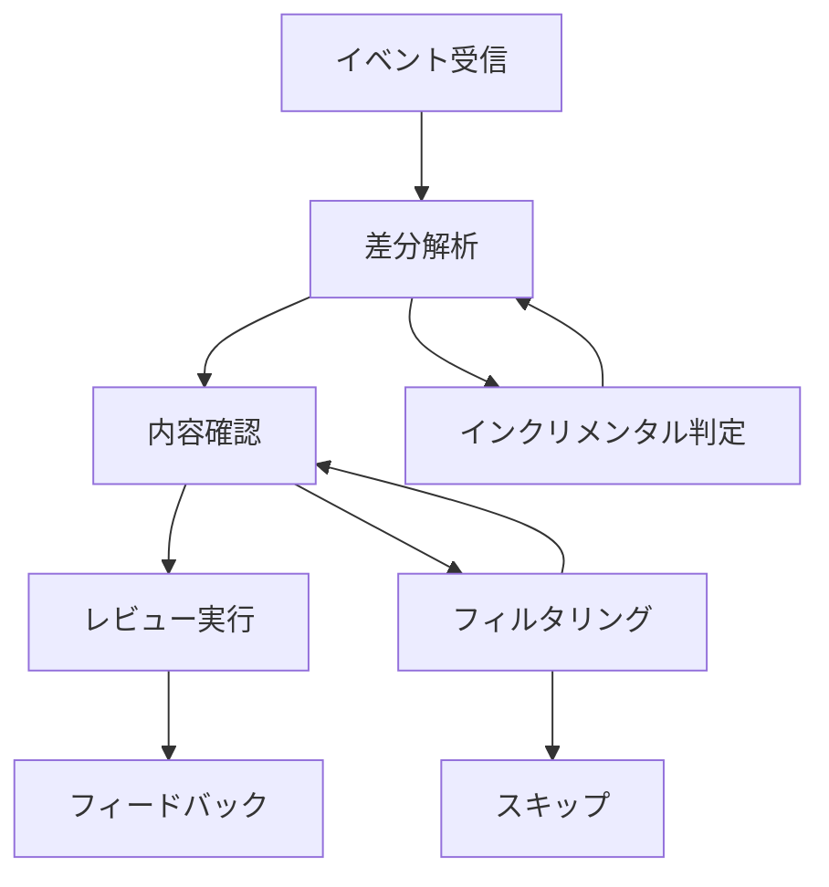

# レビューフロープロセス

## 1. プロセス概要

CodeRabbitのレビュープロセスは、効率的かつ正確なコードレビューを実現するため、以下のような流れで実行されます：



## 2. イベント処理

### 2.1 イベントの受信

```typescript
// プルリクエストイベントの確認
if (context.eventName !== 'pull_request' && 
    context.eventName !== 'pull_request_target') {
  warning(`Skipped: current event is ${context.eventName}`);
  return;
}
```

### 2.2 初期チェック

- プルリクエストの存在確認
- 無視キーワードのチェック
- 基本情報の収集

## 3. 差分処理

### 3.1 差分の取得

```typescript
// インクリメンタル差分の取得
const incrementalDiff = await octokit.repos.compareCommits({
  base: highestReviewedCommitId,
  head: context.payload.pull_request.head.sha
});

// 全体差分の取得
const targetBranchDiff = await octokit.repos.compareCommits({
  base: context.payload.pull_request.base.sha,
  head: context.payload.pull_request.head.sha
});
```

### 3.2 ファイルの選別

- パスベースのフィルタリング
- サイズ制限の確認
- 対象外ファイルの除外

## 4. コンテンツ分析

### 4.1 ファイル内容の取得

- ベースブランチの内容取得
- 差分情報の解析
- パッチの構造化

### 4.2 パッチ処理

```typescript
// パッチの解析と構造化
const patches = [];
for (const patch of splitPatch(file.patch)) {
  const patchLines = patchStartEndLine(patch);
  const hunks = parsePatch(patch);
  if (hunks) {
    patches.push([
      patchLines.newHunk.startLine,
      patchLines.newHunk.endLine,
      formatHunks(hunks)
    ]);
  }
}
```

## 5. レビュー実行

### 5.1 サマリー生成

1. **トークン管理**
   - プロンプトサイズの確認
   - 制限値のチェック
   - 分割処理の判断

2. **要約処理**
   - ファイル単位の要約
   - 全体サマリーの生成
   - リリースノートの作成

### 5.2 詳細レビュー

1. **並行処理**
   ```typescript
   const openaiConcurrencyLimit = pLimit(options.openaiConcurrencyLimit);
   const githubConcurrencyLimit = pLimit(options.githubConcurrencyLimit);
   ```

2. **レビュー最適化**
   - 重複の排除
   - コンテキストの活用
   - 優先順位付け

## 6. フィードバック管理

### 6.1 コメント生成

- インラインコメント
- サマリーコメント
- 進捗状況の更新

### 6.2 状態管理

```typescript
// コメントの更新
await commenter.comment(
  formatComment(review),
  COMMENT_TAG,
  'create'
);
```

## 7. エラー処理

### 7.1 エラーの種類

1. **API関連**
   - レート制限
   - 認証エラー
   - タイムアウト

2. **処理関連**
   - パース失敗
   - トークン超過
   - 並行処理エラー

### 7.2 リカバリー戦略

- リトライ処理
- フォールバック動作
- エラー記録

## 8. 最適化機構

### 8.1 インクリメンタル処理

1. **差分管理**
   - コミット履歴の追跡
   - 変更の特定
   - レビュー範囲の最適化

2. **状態管理**
   - レビュー済み箇所の記録
   - 部分的な更新
   - キャッシュの活用

### 8.2 リソース管理

1. **トークン制御**
   - 使用量の監視
   - 制限の遵守
   - 効率的な利用

2. **並行処理**
   - 適切な同時実行数
   - 優先順位付け
   - リソースの配分

## 9. 拡張ポイント

### 9.1 カスタマイズ

- レビュールールの追加
- フィルタリング条件の変更
- 出力形式の調整

### 9.2 統合機能

- CI/CDパイプライン連携
- 外部ツール連携
- メトリクス収集