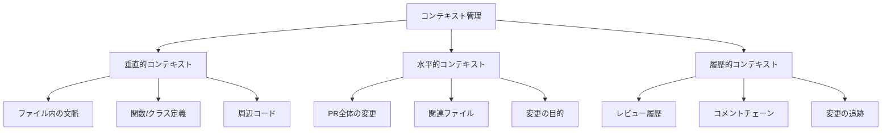
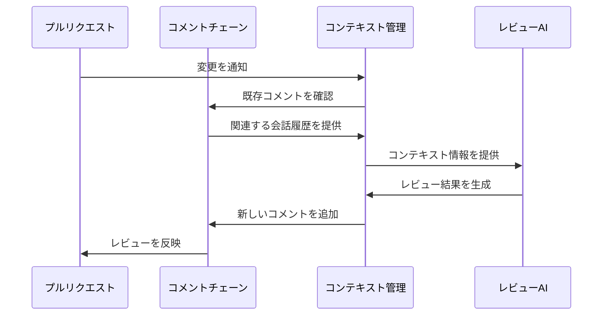

# コンテキストとコメント管理

## 1. 概要

CodeRabbitは、効果的なコードレビューを実現するため、多角的なコンテキスト管理とコメントチェーンの仕組みを提供します。この仕組みにより、単なるコードの差分チェックを超えて、変更の意図や背景を含めた包括的なレビューが可能になります。

コンテキスト管理システムは、以下のような階層的な構造で情報を収集・管理します：



## 2. コンテキストの種類と役割

### 2.1 垂直的コンテキスト

垂直的コンテキストは、個々のコードファイル内での文脈理解を支援します。これは、変更された部分の周辺のコードを含め、その変更がファイル内でどのような影響を持つかを理解するために重要です。

主な管理対象は以下の通りです：
- 変更された行の前後のコード：変更の影響範囲を正確に把握するために必要です
- 関数やクラスの完全な定義：変更が機能全体に与える影響を評価します
- ファイル内の依存関係：コードの結合度や凝集度を確認します

このコンテキストにより、レビュアーは変更の局所的な影響を正確に評価できます。

### 2.2 水平的コンテキスト

水平的コンテキストは、プルリクエスト全体を通じた変更の関連性を把握するために使用されます。複数のファイルにまたがる変更の場合、それらの変更が全体としてどのような目的を持ち、どのように連携するかを理解することが重要です。

システムは以下の情報を管理します：
- PR全体の変更概要：変更の目的と範囲を明確にします
- 関連するファイルの変更：相互に影響し合う変更を特定します
- 変更の意図や目的：開発者の意図を理解し、適切なレビューを行います

これにより、個々の変更が全体のアーキテクチャや設計にどのように適合するかを評価できます。

### 2.3 履歴的コンテキスト

履歴的コンテキストは、変更の時系列的な流れと、それに関連する議論や判断の履歴を管理します。これは、特に長期的な開発や複雑な機能の実装において重要な役割を果たします。

主な機能には以下が含まれます：
- 過去のレビューコメント：これまでの議論や決定事項を追跡します
- 議論の経緯：なぜ特定の実装方法が選択されたのかを理解します
- 変更の進捗状況：開発の進行状況と残課題を把握します

この情報により、一貫性のあるレビューと継続的な改善が可能になります。

## 3. コメントチェーンの管理

コメントチェーンは、レビューの文脈を保持し、議論の流れを追跡するための重要な機能です。システムは以下のような構造でコメントを管理します：

```typescript
interface CommentChain {
  parent: {
    id: string;
    body: string;
    path: string;
    position: number;
  };
  replies: Array<{
    id: string;
    body: string;
    in_reply_to: string;
  }>;
  meta: {
    status: 'open' | 'resolved';
    context: ReviewContext;
  };
}
```

この構造により、以下のような高度な管理が可能になります：
- コメントの階層関係の追跡
- 議論の状態管理
- コンテキスト情報との紐付け

### 3.1 コメントの種類と役割

システムは目的に応じて異なる種類のコメントを提供します：

**レビューコメント**は、コードの特定部分に対する具体的な指摘や提案を行うために使用されます。これらは通常、改善が必要な箇所や、疑問点を明確にするために使用されます。

**返信コメント**は、レビューコメントに対する応答や、さらなる議論を行うために使用されます。これにより、レビュアーと開発者の間で建設的な対話が可能になります。

**要約コメント**は、変更全体の概要や方針を説明するために使用されます。これは特に大規模な変更や、複雑な機能追加の際に重要です。

## 4. コンテキストの収集と利用

### 4.1 情報収集プロセス

システムは、GitHubのAPIを使用して必要な情報を収集します：

```typescript
// 差分情報の取得
const targetBranchDiff = await octokit.repos.compareCommits({
  base: context.payload.pull_request.base.sha,
  head: context.payload.pull_request.head.sha
});
```

この処理により、変更の詳細な差分情報が取得され、レビューのための基礎データとなります。

また、ファイルの完全な内容も必要に応じて取得します：

```typescript
// ファイル内容の取得
const contents = await octokit.repos.getContent({
  path: file.filename,
  ref: context.payload.pull_request.base.sha
});
```

これにより、変更の前後の状態を詳細に比較することが可能になります。

### 4.2 レビューコンテキストの構築

収集した情報は、以下のような構造でAIレビュー用のプロンプトに統合されます：

```typescript
reviewPrompt = `
## PR Context
${pr.title}
${pr.description}

## File Changes Overview
${summary}

## Current File
${filename}

## Relevant Changes
${patches}

## Previous Reviews
${commentHistory}
`;
```

このように構造化された情報により、AIは文脈を理解した上で適切なレビューを行うことができます。

## 5. コメントチェーンの処理

### 5.1 コメント管理フロー

コメントチェーンの処理は、以下のような流れで行われます：



この流れにより、以下のような一貫性のある処理が実現されます：

1. **変更の検出と通知**：
プルリクエストの更新を検出すると、システムは自動的にコンテキスト管理システムに通知を送ります。これにより、タイムリーなレビューの開始が可能になります。

2. **既存コメントの確認**：
関連する過去のコメントや議論を取得し、レビューの重複を防ぎつつ、継続的な議論の文脈を維持します。

3. **コンテキストの統合**：
収集した情報を適切に組み合わせ、AIレビュアーが必要とする形式に整理します。

### 5.2 コメントの追跡管理

コメントの状態管理は、以下の要素を考慮して行われます：

1. **状態管理の重要性**：
コメントの状態（未解決、解決済み、対応中など）を追跡することで、レビューの進捗を明確に把握できます。これは特に大規模な変更や長期的な開発において重要です。

2. **更新処理の仕組み**：
新しいコメントの追加や既存コメントの更新は、一貫性を保ちながら行われます。システムは以下の点に特に注意を払います：
- コメントチェーンの整合性維持
- 関連する状態の適切な更新
- 通知の適切な配信

## 6. 最適化とリソース管理

### 6.1 コンテキストの最適化

コンテキスト情報の効率的な管理のため、以下のような最適化を行っています：

1. **情報の選択的収集**：
レビューに必要な情報を的確に選択することで、処理効率を向上させています：
- 変更の影響範囲に基づく収集範囲の決定
- 重要度に応じた優先順位付け
- トークン制限を考慮した情報の圧縮

2. **キャッシュ戦略の実装**：
頻繁にアクセスされる情報は効率的にキャッシュされ、以下のような利点をもたらします：
- APIリクエストの削減
- レスポンスタイムの改善
- リソース使用の最適化

### 6.2 API利用の効率化

GitHub APIとの連携において、以下のような最適化を実施しています：

1. **レート制限への対応**：
APIのレート制限に配慮し、以下の戦略を採用しています：
- リクエストの適切なスロットリング
- バッチ処理による効率化
- キャッシュの活用によるリクエスト削減

2. **非同期処理の活用**：
システムのレスポンス性を維持するため、以下のような非同期処理を実装しています：
- バックグラウンドでのコンテキスト更新
- 並行処理による効率化
- イベントドリブンな処理の採用

## 7. 拡張性と統合

### 7.1 カスタマイズの可能性

システムは、以下のような拡張ポイントを提供しています：

1. **コメント管理のカスタマイズ**：
組織固有のニーズに応じて、以下のようなカスタマイズが可能です：
- カスタムタグやラベルの追加
- 独自のフィルタリングルールの実装
- コメント表示形式のカスタマイズ

2. **コンテキスト拡張の機能**：
外部システムとの連携や独自の分析を追加できます：
- 社内システムとの統合
- カスタムメトリクスの収集
- 独自の分析ロジックの実装

### 7.2 外部システムとの連携

CI/CDパイプラインなど、外部システムとの連携を効果的に行うための機能を提供しています：

1. **ビルドシステムとの統合**：
継続的インテグレーションの結果を活用し、より包括的なレビューを実現します：
- ビルド結果の自動取得
- テスト結果の統合
- デプロイ状態の反映

2. **通知システムとの連携**：
重要な情報を適切なタイミングで関係者に伝えるため、以下のような機能を実装しています：
- Slackなどの通知システムとの連携
- メール通知の設定
- カスタム通知ルールの定義

これらの機能により、組織の開発プロセスに合わせた柔軟なカスタマイズと拡張が可能となります。