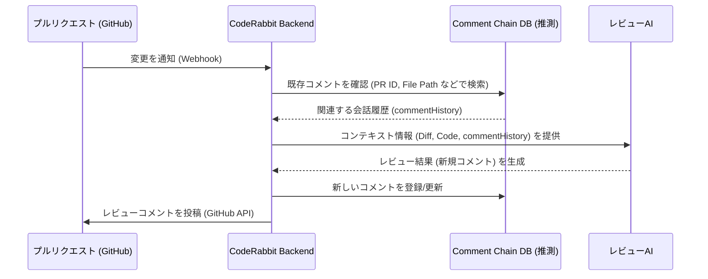

# コンテキストとコメント管理

## 1. 概要

CodeRabbitは、効果的なコードレビューを実現するため、多角的なコンテキスト管理と、本稿で「コメントチェーン」と呼ぶ仕組みを提供していると考えられます。この仕組みにより、単なるコードの差分チェックを超えて、変更の意図や背景、過去の議論を含めた包括的なレビューが可能になります。

**注記:** このドキュメントは CodeRabbit の動作を分析・推測したものであり、Code Hedgehog の仕様とは異なります。Code Hedgehog では、同様の目的を達成するために、GitHub の標準機能 (コメントスレッド、Resolve conversation など) を活用するアプローチを採用しています。詳細は [GitHub Bot: コメント関連機能仕様](../../../project-specs/05.github-bot/comment-chain-features.md) を参照してください。

CodeRabbit のコンテキスト管理システムは、以下のような階層的な構造で情報を収集・管理していると推測されます：

```mermaid
graph TD
    A[コンテキスト管理 (CodeRabbit)] --> B[垂直的コンテキスト]
    A --> C[水平的コンテキスト]
    A --> D[履歴的コンテキスト]
    
    B --> B1[ファイル内の文脈]
    B --> B2[関数/クラス定義]
    B --> B3[周辺コード]
    
    C --> C1[PR全体の変更]
    C --> C2[関連ファイル]
    C --> C3[変更の目的]
    
    D --> D1[レビュー履歴]
    D --> D2[コメントチェーン (独自管理)]
    D --> D3[変更の追跡]
```

## 2. コンテキストの種類と役割 (CodeRabbit 分析)

### 2.1 垂直的コンテキスト

垂直的コンテキストは、個々のコードファイル内での文脈理解を支援します。これは、変更された部分の周辺のコードを含め、その変更がファイル内でどのような影響を持つかを理解するために重要です。

主な管理対象は以下の通りです：
- 変更された行の前後のコード：変更の影響範囲を正確に把握するために必要です
- 関数やクラスの完全な定義：変更が機能全体に与える影響を評価します
- ファイル内の依存関係：コードの結合度や凝集度を確認します

このコンテキストにより、レビュアーは変更の局所的な影響を正確に評価できます。

### 2.2 水平的コンテキスト

水平的コンテキストは、プルリクエスト全体を通じた変更の関連性を把握するために使用されます。複数のファイルにまたがる変更の場合、それらの変更が全体としてどのような目的を持ち、どのように連携するかを理解することが重要です。

システムは以下の情報を管理します：
- PR全体の変更概要：変更の目的と範囲を明確にします
- 関連するファイルの変更：相互に影響し合う変更を特定します
- 変更の意図や目的：開発者の意図を理解し、適切なレビューを行います

これにより、個々の変更が全体のアーキテクチャや設計にどのように適合するかを評価できます。

### 2.3 履歴的コンテキスト

履歴的コンテキストは、変更の時系列的な流れと、それに関連する議論や判断の履歴を管理します。これは、特に長期的な開発や複雑な機能の実装において重要な役割を果たします。

主な機能には以下が含まれます：
- **過去のレビューコメント:** これまでの議論や決定事項を追跡します。Code Hedgehog では、これを `commentHistory` として収集し、プロセッサに渡します。
- **議論の経緯 (コメントチェーン):** なぜ特定の実装方法が選択されたのかを理解します。CodeRabbit はこれを独自に管理している可能性がありますが、Code Hedgehog では GitHub のコメントスレッド機能を利用します。
- **変更の進捗状況:** 開発の進行状況と残課題を把握します。Code Hedgehog では GitHub の Resolve conversation 機能と Checks API を連携させてこれを実現します。

この情報により、一貫性のあるレビューと継続的な改善が可能になります。

## 3. コメントチェーンの管理 (CodeRabbit 分析)

CodeRabbit における「コメントチェーン」は、レビューの文脈を保持し、議論の流れを追跡するための重要な機能であると推測されます。システムは以下のような独自の構造でコメントを管理している可能性があります：

```typescript
// CodeRabbit が内部的に持つ可能性のあるデータ構造 (推測)
interface CommentChain {
  parent: { // 元の指摘コメント
    id: string;
    body: string;
    path: string;
    position: number;
  };
  replies: Array<{ // 返信コメント
    id: string;
    body: string;
    in_reply_to: string; // 親コメントID
  }>;
  meta: {
    status: 'open' | 'resolved'; // 議論の状態
    context: ReviewContext; // 関連コンテキスト
  };
}
```

この構造により、以下のような高度な管理が可能になると考えられます：
- コメントの階層関係の追跡
- 議論の状態管理 (`open`/`resolved`)
- コンテキスト情報との紐付け

**Code Hedgehog との比較:** Code Hedgehog では、このような独自のデータ構造を内部で管理する代わりに、GitHub の標準機能を利用します。
- **階層関係:** GitHub のコメント返信機能 (スレッド) を利用します。
- **状態管理:** GitHub の "Resolve conversation" 機能を利用します。
- **コンテキスト紐付け:** コメント取得時に GitHub API から得られる情報 (ファイルパス、行番号など) を利用します。

### 3.1 コメントの種類と役割 (CodeRabbit 分析)

CodeRabbit は目的に応じて異なる種類のコメントを提供している可能性があります：

**レビューコメント**は、コードの特定部分に対する具体的な指摘や提案を行うために使用されます。

**返信コメント**は、レビューコメントに対する応答や、さらなる議論を行うために使用されます。Code Hedgehog では、インタラクション機能 (`@bot`) に対する応答がこれに相当し、GitHub の返信として投稿されます。

**要約コメント**は、変更全体の概要や方針を説明するために使用されます。Code Hedgehog では、プロセッサが出力するサマリー (`ProcessOutput.summary`) を Checks API に表示することで、同様の目的を果たします。

## 4. コンテキストの収集と利用

### 4.1 情報収集プロセス

システムは、GitHubのAPIを使用して必要な情報を収集します：

```typescript
// 差分情報の取得
const targetBranchDiff = await octokit.repos.compareCommits({
  base: context.payload.pull_request.base.sha,
  head: context.payload.pull_request.head.sha
});
```

この処理により、変更の詳細な差分情報が取得され、レビューのための基礎データとなります。

また、ファイルの完全な内容も必要に応じて取得します：

```typescript
// ファイル内容の取得
const contents = await octokit.repos.getContent({
  path: file.filename,
  ref: context.payload.pull_request.base.sha
});
```

これにより、変更の前後の状態を詳細に比較することが可能になります。

### 4.2 レビューコンテキストの構築

収集した情報は、以下のような構造でAIレビュー用のプロンプトに統合されます：

```typescript
reviewPrompt = `
## PR Context
${pr.title}
${pr.description}

## File Changes Overview
${summary}

## Current File
${filename}

## Relevant Changes
${patches}

## Previous Reviews
${commentHistory}
`;
```

このように構造化された情報により、AIは文脈を理解した上で適切なレビューを行うことができます。

## 5. コメントチェーンの処理 (CodeRabbit 分析)

### 5.1 コメント管理フロー (推測)

CodeRabbit におけるコメントチェーンの処理は、以下のような流れで行われていると推測されます：



この流れにより、以下のような一貫性のある処理が実現されると考えられます：

1. **変更の検出と通知**：
プルリクエストの更新を GitHub Webhook などで検出し、CodeRabbit のバックエンド処理を開始します。

2. **既存コメントの確認**：
CodeRabbit が内部で管理するデータベース (Comment Chain DB) から、関連する過去のコメントや議論を取得し、レビューの重複を防ぎつつ、継続的な議論の文脈を維持します。

3. **コンテキストの統合**：
収集した情報 (差分、コード、コメント履歴など) を適切に組み合わせ、AI レビュアーが必要とする形式に整理します。

**Code Hedgehog との比較:** Code Hedgehog では、GitHub Actions がトリガーとなり、`Action Runner` が GitHub API を直接叩いてコメント履歴を取得します。独自のコメントデータベースは持ちません。

### 5.2 コメントの追跡管理 (CodeRabbit 分析)

CodeRabbit はコメントの状態管理を内部で行っている可能性があります。

1. **状態管理の重要性**：
コメントの状態（未解決 `open`、解決済み `resolved` など）を追跡することで、レビューの進捗を明確に把握できます。

2. **更新処理の仕組み (推測)**：
CodeRabbit は、ユーザーのアクション (例: CodeRabbit UI 上での操作、特定のコメントコマンド) や GitHub 上のイベント (例: "Resolve conversation") をトリガーとして、内部データベースのコメント状態 (`status`) を更新している可能性があります。

**Code Hedgehog との比較:** Code Hedgehog では、状態管理は GitHub の "Resolve conversation" 機能に依存します。Bot は GitHub API を通じてその状態を取得し、Checks API に反映させる役割を担います。Bot 自身が状態を保持・更新するわけではありません。

## 6. 最適化とリソース管理

### 6.1 コンテキストの最適化

コンテキスト情報の効率的な管理のため、以下のような最適化を行っています：

1. **情報の選択的収集**：
レビューに必要な情報を的確に選択することで、処理効率を向上させています：
- 変更の影響範囲に基づく収集範囲の決定
- 重要度に応じた優先順位付け
- トークン制限を考慮した情報の圧縮

2. **キャッシュ戦略の実装**：
頻繁にアクセスされる情報は効率的にキャッシュされ、以下のような利点をもたらします：
- APIリクエストの削減
- レスポンスタイムの改善
- リソース使用の最適化

### 6.2 API利用の効率化

GitHub APIとの連携において、以下のような最適化を実施しています：

1. **レート制限への対応**：
APIのレート制限に配慮し、以下の戦略を採用しています：
- リクエストの適切なスロットリング
- バッチ処理による効率化
- キャッシュの活用によるリクエスト削減

2. **非同期処理の活用**：
システムのレスポンス性を維持するため、以下のような非同期処理を実装しています：
- バックグラウンドでのコンテキスト更新
- 並行処理による効率化
- イベントドリブンな処理の採用

## 7. 拡張性と統合

### 7.1 カスタマイズの可能性

システムは、以下のような拡張ポイントを提供しています：

1. **コメント管理のカスタマイズ**：
組織固有のニーズに応じて、以下のようなカスタマイズが可能です：
- カスタムタグやラベルの追加
- 独自のフィルタリングルールの実装
- コメント表示形式のカスタマイズ

2. **コンテキスト拡張の機能**：
外部システムとの連携や独自の分析を追加できます：
- 社内システムとの統合
- カスタムメトリクスの収集
- 独自の分析ロジックの実装

### 7.2 外部システムとの連携

CI/CDパイプラインなど、外部システムとの連携を効果的に行うための機能を提供しています：

1. **ビルドシステムとの統合**：
継続的インテグレーションの結果を活用し、より包括的なレビューを実現します：
- ビルド結果の自動取得
- テスト結果の統合
- デプロイ状態の反映

2. **通知システムとの連携**：
重要な情報を適切なタイミングで関係者に伝えるため、以下のような機能を実装しています：
- Slackなどの通知システムとの連携
- メール通知の設定
- カスタム通知ルールの定義

これらの機能により、組織の開発プロセスに合わせた柔軟なカスタマイズと拡張が可能となります。