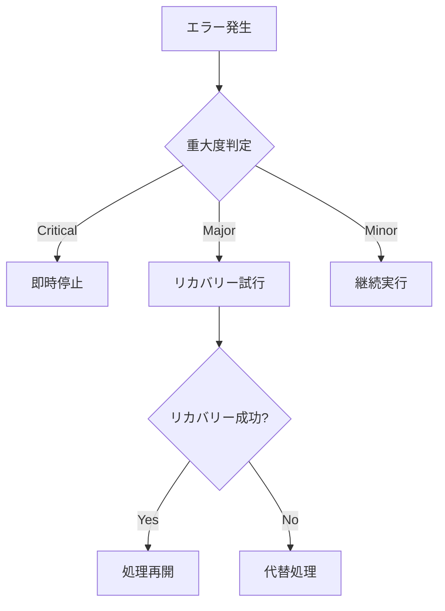

# エラー処理と例外管理

## 1. エラー処理の基本方針

CodeRabbitのエラー処理は、システムの信頼性と継続的な運用を確保するため、以下の原則に基づいて設計されています。

### 1.1 基本原則



実装例：
```typescript
try {
  res = await this.chat_(message, ids)
  return res
} catch (e: unknown) {
  if (e instanceof ChatGPTError) {
    warning(`Failed to chat: ${e}, backtrace: ${e.stack}`)
  }
  return res
}
```

### 1.2 エラーの分類と処理

1. **OpenAI API関連エラー**
   - レート制限
   - トークン制限
   - タイムアウト

2. **GitHub API関連エラー**
   - 認証エラー
   - アクセス制限
   - データ取得失敗

3. **処理関連エラー**
   - パース失敗
   - メモリ不足
   - 並行処理の問題

## 2. リトライメカニズム

### 2.1 基本的なリトライ

OpenAI APIとの通信では、以下のようなリトライ機構を実装しています：

```typescript
response = await pRetry(() => this.api!.sendMessage(message, opts), {
  retries: this.options.openaiRetries
});
```

設定可能なパラメータ：
- リトライ回数
- バックオフ時間
- タイムアウト値

### 2.2 タイムアウト制御

APIリクエストのタイムアウト管理：

```typescript
const opts: SendMessageOptions = {
  timeoutMs: this.options.openaiTimeoutMS
};
if (ids.parentMessageId) {
  opts.parentMessageId = ids.parentMessageId;
}
```

## 3. エラー状態の管理

### 3.1 状態の追跡と記録

1. **ログレベルの使い分け**
   ```typescript
   // 重大なエラー
   setFailed('The OpenAI API is not initialized');
   
   // 警告レベル
   warning('openai response is null');
   
   // 情報レベル
   info(`openai sendMessage response time: ${end - start} ms`);
   ```

2. **コンテキスト情報の保持**
   ```typescript
   interface ErrorContext {
     timestamp: Date;
     operation: string;
     inputs: {
       message: string;
       options: Options;
     };
     state: {
       retryCount: number;
       lastError: Error | null;
     };
   }
   ```

### 3.2 エラー伝播の制御

エラーの影響を最小限に抑えるための戦略：

1. **局所的な処理**
   ```typescript
   catch (e: any) {
     warning(
       `Failed to get file contents: ${e}. This is OK if it's a new file.`
     );
   }
   ```

2. **フォールバック処理**
   ```typescript
   let responseText = '';
   if (response != null) {
     responseText = response.text;
   } else {
     warning('openai response is null');
   }
   ```

## 4. リソース管理とパフォーマンス

### 4.1 並行処理の制御

リソースの効率的な利用：

```typescript
const openaiConcurrencyLimit = pLimit(options.openaiConcurrencyLimit);
const githubConcurrencyLimit = pLimit(options.githubConcurrencyLimit);
```

主な制御ポイント：
- API制限の遵守
- メモリ使用量の管理
- 処理の優先順位付け

### 4.2 バッチ処理の最適化

大量のデータ処理時の効率化：

```typescript
const batchSize = 10;
for (let i = 0; i < summaries.length; i += batchSize) {
  const summariesBatch = summaries.slice(i, i + batchSize);
  // バッチ処理の実行
}
```

## 5. モニタリングと分析

### 5.1 パフォーマンス監視

実行時間の計測と記録：

```typescript
const start = Date.now();
// 処理実行
const end = Date.now();
info(`Operation completed in ${end - start} ms`);
```

### 5.2 エラー分析

エラーパターンの特定と対策：

1. **発生頻度の追跡**
   - API制限到達回数
   - タイムアウト発生率
   - リトライ成功率

2. **影響度の評価**
   - 処理の中断回数
   - リカバリー成功率
   - ユーザー影響の範囲

## 6. 継続的な改善

### 6.1 エラー防止策

1. **事前チェック**
   ```typescript
   if (!message) {
     return ['', {}];
   }
   
   if (this.api == null) {
     setFailed('The OpenAI API is not initialized');
     return;
   }
   ```

2. **バリデーション**
   ```typescript
   const tokens = getTokenCount(summarizePrompt);
   if (tokens > options.lightTokenLimits.requestTokens) {
     info(`summarize: diff tokens exceeds limit, skip ${filename}`);
     return null;
   }
   ```

### 6.2 システムの強化

1. **エラー耐性の向上**
   - バッファーの確保
   - 代替処理パスの用意
   - グレースフルデグラデーション

2. **監視の強化**
   - メトリクスの収集
   - アラートの設定
   - トレンド分析

これらの実装により、システムの安定性と信頼性を確保しています。