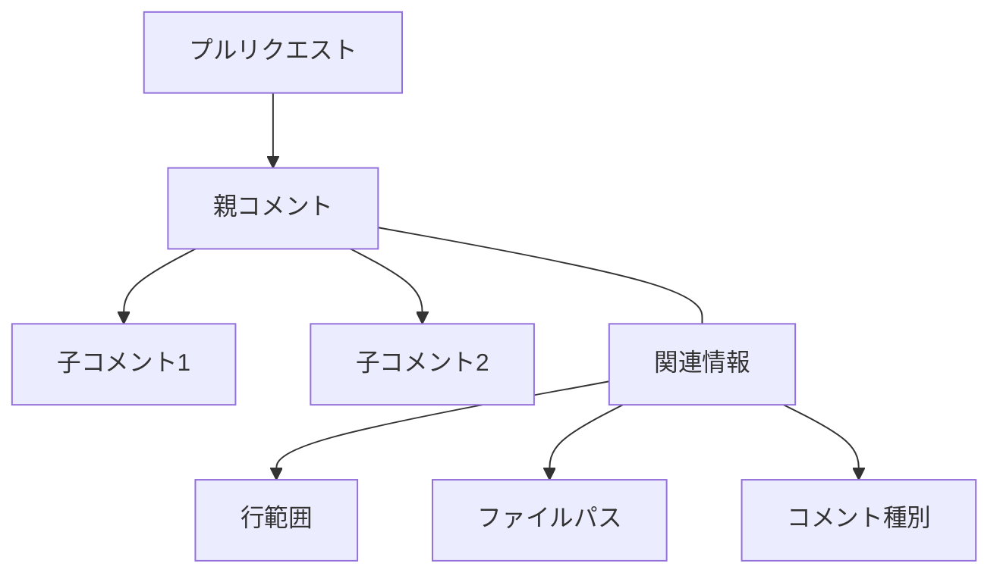
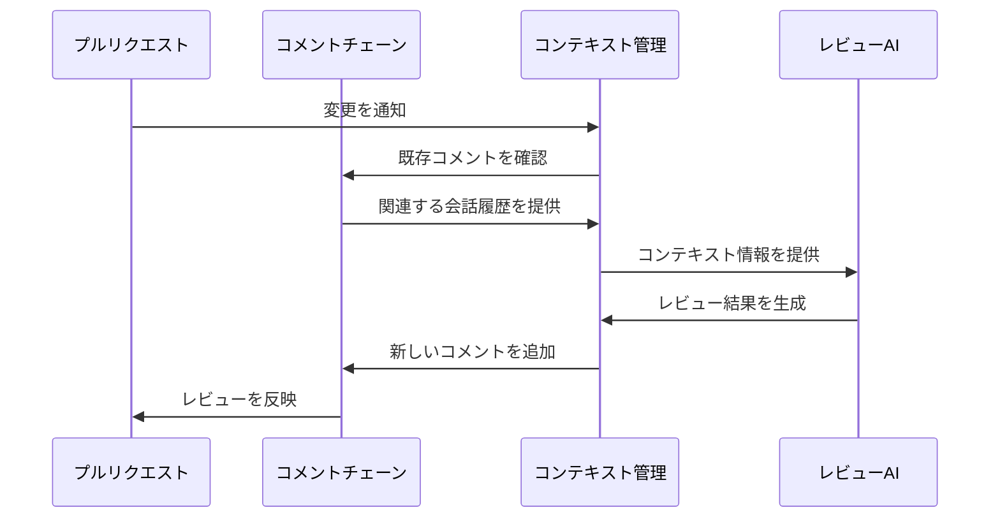

# CodeRabbitのコメントチェーンとコンテキスト管理

## 1. 概要

CodeRabbitは、プルリクエストのレビューにおいて文脈を理解し、より適切なレビューを行うために、コメントの履歴と関連情報を体系的に管理しています。

### 重要な特徴

1. **コメントの階層管理**
   - 親コメントと子コメントの関係を明示的に追跡
   - レビュー文脈の一貫性を維持
   - コメントチェーンによる会話の流れの保持

2. **コンテキストの多角的な把握**
   - プルリクエストの要約情報の活用
   - 関連する差分情報の参照
   - 過去のレビューコメントの考慮

3. **効率的な情報管理**
   - 行範囲ベースのフィルタリング
   - タグによるコメントの分類
   - トークン制限を考慮した情報圧縮

## 2. コメントチェーンの仕組み

### 2.1 基本構造



### 2.2 コメントの種類

- **レビューコメント**：コードの特定部分に対する指摘や提案
- **返信コメント**：レビューコメントへの応答や議論
- **要約コメント**：変更全体の概要や方針の説明

## 3. レビュープロセスにおけるコンテキスト活用



## 4. コンテキスト管理の重要ポイント

### 4.1 情報の階層化

1. **プルリクエストレベル**
   - タイトルと説明
   - 全体的な変更の要約
   - レビューの状態

2. **ファイルレベル**
   - 変更箇所の特定
   - 関連するコメントの追跡
   - 差分情報の管理

3. **コメントレベル**
   - 会話の文脈維持
   - 関連するレビューポイントの紐付け
   - 解決状態の追跡

### 4.2 コンテキスト活用の例

1. **追加コミット時の処理**
   ```mermaid
   sequenceDiagram
       participant New as 新規コミット
       participant History as レビュー履歴
       participant Review as レビュー処理

       New->>History: 変更を通知
       History->>Review: 過去のレビュー内容を提供
       Review->>Review: 文脈を考慮してレビュー
       Review->>History: 新しいレビューを追加
   ```

2. **レビューコメントへの応答**
   - 過去の会話履歴の参照
   - 関連する変更箇所の確認
   - コンテキストを考慮した返答生成

## 5. 設計上の重要な考慮点

1. **一貫性の維持**
   - コメントチェーンの整合性確保
   - レビュー文脈の継続的な追跡
   - 変更履歴との同期

2. **拡張性の確保**
   - 新しいコメントタイプの追加
   - 外部システムとの連携
   - カスタマイズ可能な管理ルール

3. **効率性の実現**
   - 必要な情報の選択的な利用
   - コンテキストの効率的な更新
   - リソース使用の最適化

## 6. 実装における注意点

1. **コメント管理**
   - 一意な識別子による追跡
   - 親子関係の確実な維持
   - 削除・更新時の整合性確保

2. **コンテキスト処理**
   - トークン制限の考慮
   - 重要度に基づく情報選択
   - キャッシュ戦略の適用

3. **APIとの連携**
   - レート制限への対応
   - エラーハンドリング
   - 非同期処理の活用