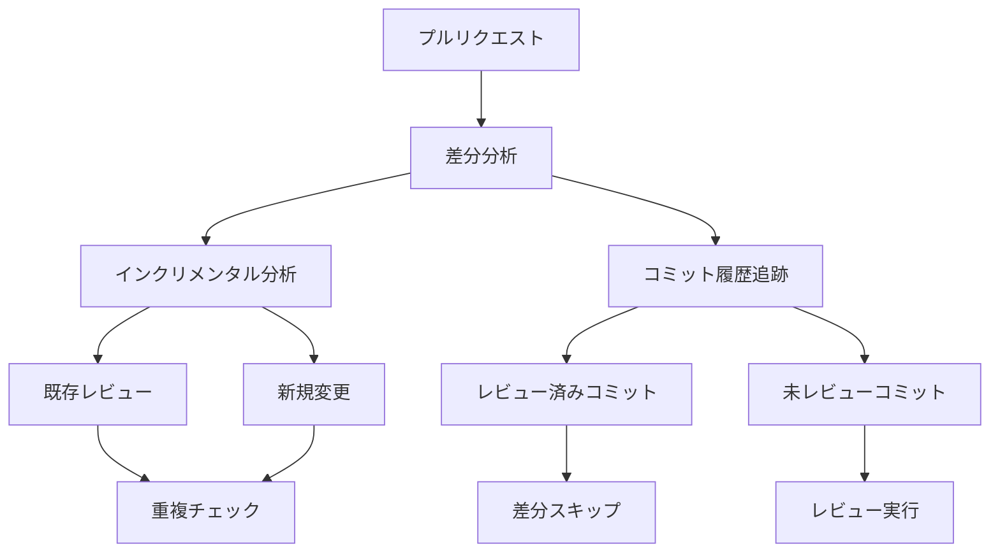
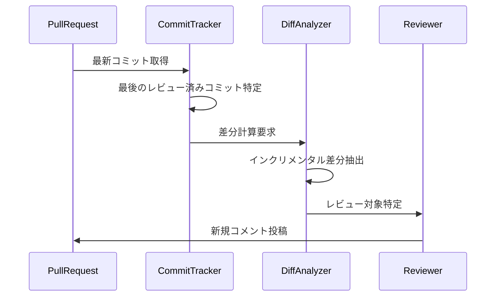

# CodeRabbit重複指摘防止機構の分析

## 1. 重複防止の基本戦略

CodeRabbitは以下の方法で重複指摘を防止しています：



## 2. インクリメンタルレビューの仕組み

### 2.1 コミットベースの変更追跡



### 2.2 レビュー履歴の管理

1. **コミットIDベースの追跡**
   - レビュー済みコミットの記録
   - 差分の効率的な計算
   - 変更の連続性の把握

2. **ファイルレベルの変更追跡**
   - パス単位での変更検出
   - 修正履歴の保持
   - 影響範囲の特定

## 3. 重複検出のメカニズム

### 3.1 重複の判定基準

1. **位置ベースの重複**
   - 同一ファイルの同一行
   - 近接する行への指摘
   - 移動されたコードブロック

2. **内容ベースの重複**
   - 類似したコメント内容
   - 同一の指摘カテゴリ
   - 解決済みの問題

### 3.2 重複排除の処理

```typescript
interface DuplicationCheck {
  // ファイルパスと行範囲による重複チェック
  locationBased: {
    filePath: string;
    startLine: number;
    endLine: number;
  };

  // コメント内容による重複チェック
  contentBased: {
    category: string;
    severity: string;
    suggestion: string;
  };
}
```

## 4. 最適化の仕組み

### 4.1 バッチ処理による効率化

1. **要約の集約**
   - 複数ファイルの要約をバッチ処理
   - トークン使用量の最適化
   - 処理時間の短縮

2. **コンテキストの共有**
   - 関連する変更の一括処理
   - 共通コンテキストの再利用
   - メモリ使用量の最適化

### 4.2 スキップロジック

1. **レビュー不要な変更の判定**
   - フォーマット変更のみ
   - コメントの修正
   - 自動生成コード

2. **既知の問題の認識**
   - 過去に指摘済みの問題
   - 解決済みの課題
   - 意図的な例外

## 5. エラー処理とリカバリー

### 5.1 部分的な失敗への対応

- 失敗したファイルの記録
- 再試行メカニズムの提供
- 部分的な結果の保存

### 5.2 整合性の維持

- コミット履歴の一貫性確認
- 並行処理時の競合解決
- 不完全な状態からの回復

## 6. 設計上の重要ポイント

1. **効率性**
   - インクリメンタル処理による最適化
   - 重複チェックの早期実行
   - リソース使用の効率化

2. **正確性**
   - 誤検出の最小化
   - コンテキストの適切な考慮
   - エッジケースの処理

3. **拡張性**
   - カスタム重複ルールの追加
   - 新しい検出戦略の組み込み
   - プラグイン機構の提供